# 1.2 Przygotowanie nośnika
Poniżej znajdziesz szczegółowy opis tworzenia nośników USB w celu instalacji systemu Fedora.

## Windows

### Rufus
1. Pobierz oprogramowanie Rufus z oficjalnej strony: [https://rufus.ie/](https://rufus.ie/)
2. Uruchom program Rufus.

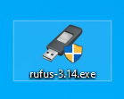

3. Wybierz pendrive, na którym ma zostać umieszczony obraz ISO [1]. Wybierz obraz ISO, który ma zostać umieszczony na pendrive [2]. Po wybraniu nośnika i obrazu systemu, kliknij na przycisk START [3].

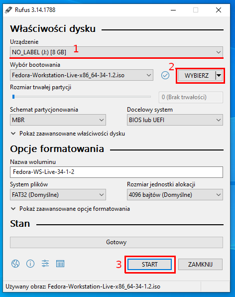

4. Na zapytanie o obraz "ISOHybrid" odpowiadamy twierdząco z domyślną opcją "Zapisz w trybie Obraz ISO (zalecane)".

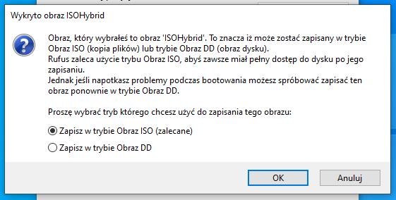

5. Na zapytanie dotyczące pobrania Syslinux również odpowiadamy twierdząco.

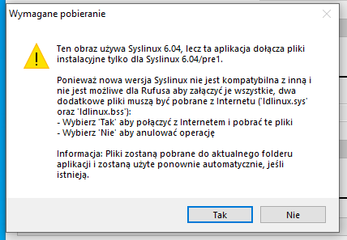

6. Rufus zapyta o format nośnika - jeśli jesteśmy pewni, potwierdzamy OK.

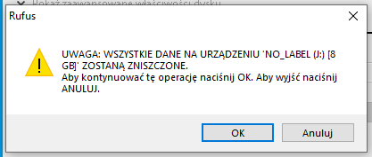

7. Rufus rozpoczyna przygotowanie bootowalnego pendrive. To może chwilę potrwać w zależności od zastosowanego nośnika.

8. Gdy Rufus zakończy przytowania można zamknąć okno programu i użyć nośnik w celu przetestowania bądź instalacji systemu.

### Balena Etcher
1. Pobieramy i instalujemy oprogramowanie Balena Etcher ze strony: [https://www.balena.io/etcher/](https://www.balena.io/etcher/)
2. Uruchamiamy program Balena Etcher.

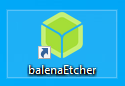

3. W głównym menu wybieramy opcję "Flash from file" i wskazujemy plik z obrazem ISO.

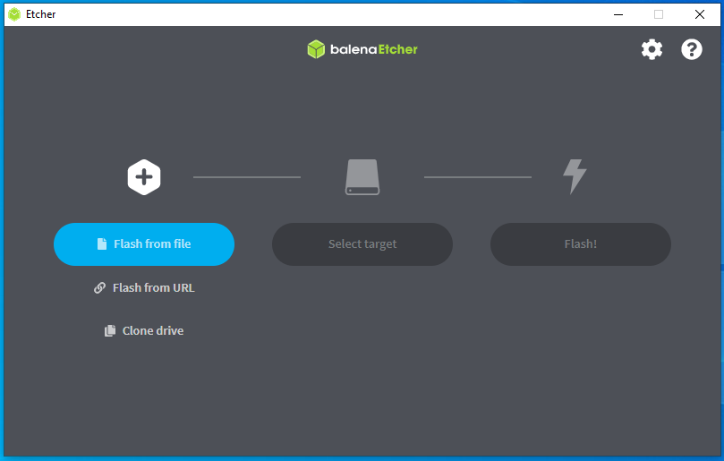

4. Gdy obraz zostanie wybrany, klikamy na przycisk "Select target".

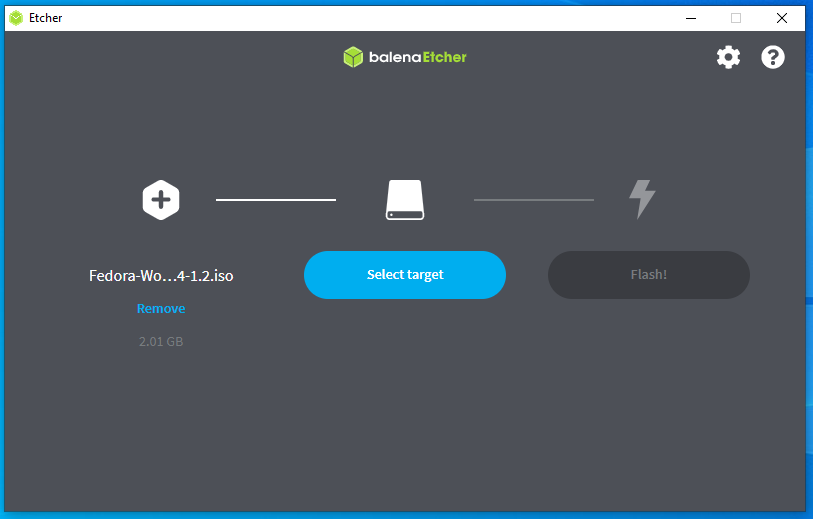

5. Wskazujemy pendrive, który ma zostać wykorzystany i potwierdzamy decyzję przyciskiem "Select".

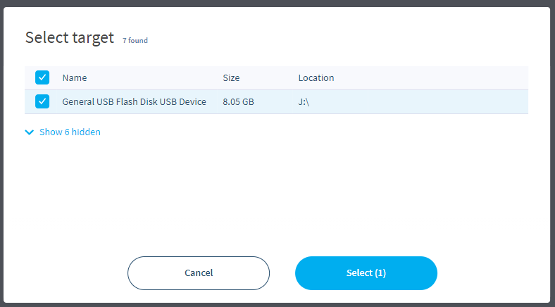

6. Po dokonaniu wyboru klikamy na przycisk "Flash!" w celu rozpoczęcia.

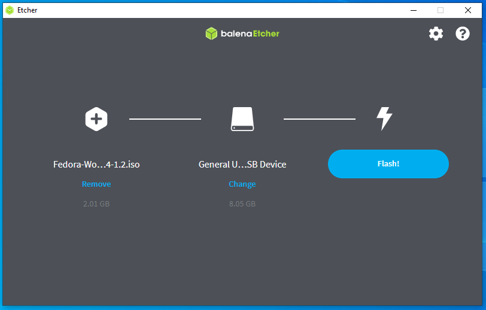

7. Program rozpoczyna pracę - dokonane zostanie formatowanie nośnika, skopiowanie obrazu na nośnik i jego weryfikacja.

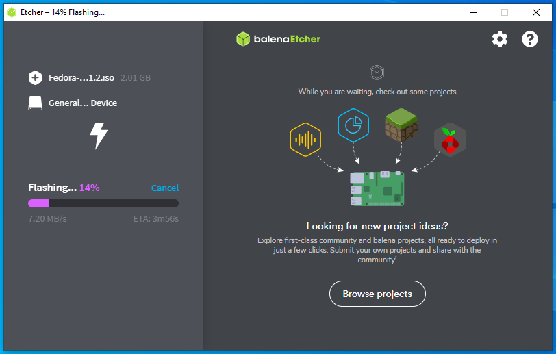

8. Po ukończeniu tworzenia bootowalnego pendrive, można zamknąć okno programu i użyć nośnik w celu przetestowania bądź instalacji systemu.

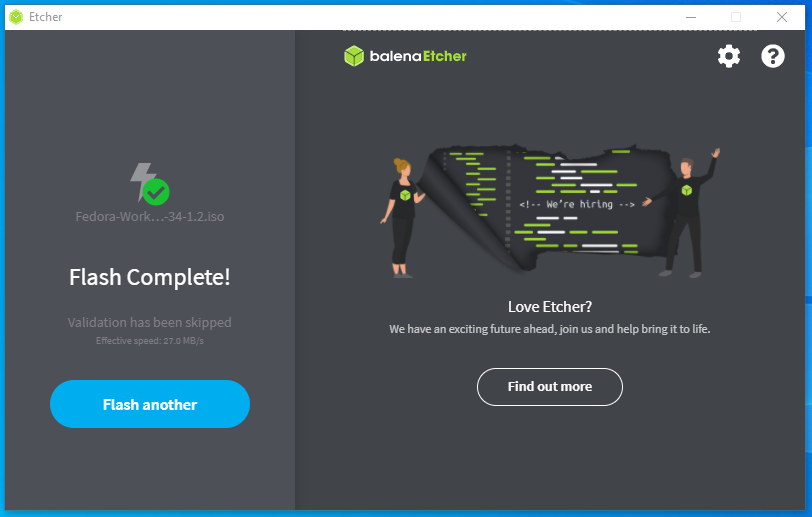

### Ventoy
1. Pobieramy plik zip przeznaczony dla systemu Windows z tej strony: [https://www.ventoy.net/en/download.html](https://www.ventoy.net/en/download.html)
2. Rozpakowujemy plik zip i przechodzimy do rozpakowanego katalogu.
3. Uruchamiamy plik Ventoy2Disk.exe

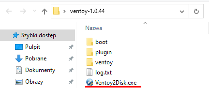

4. Wybieramy nośnik z listy [1] i klikamy na przycisk "Install" [2].

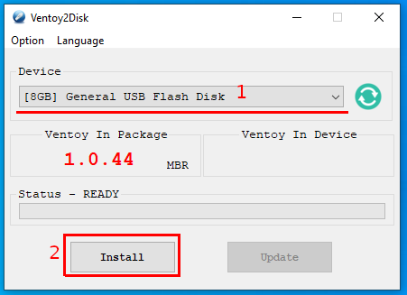

5. Ventoy zapyta się o sformatowanie nośnika pierwszy raz - potwierdzamy.

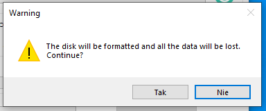

6. Dla pewności Ventoy zada ponownie to pytanie - ponownie potwierdzamy.

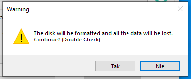

7. Ventoy rozpoczyna przygotowanie środowiska dla bootowalnego pendrive. Sukces zostanie oznajmiony stosownym komunikatem.

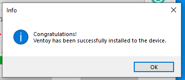

8. W celu umieszczenia obrazu ISO na utworzonym nośniku otwieramy Eksplorator Windows. Odszukujemy pendrive z etykietą Ventoy i otwieramy go.

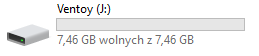

9. Kopiujemy plik ISO na nośnik.

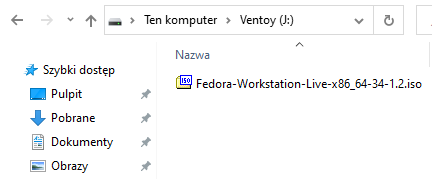

10. Po zakończeniu kopiowania można użyć nośnik w celu przetestowania bądź instalacji systemu.

### Fedora Media Writer
1. Pobieramy i instalujemy Fedora Media Writer ze strony: [https://getfedora.org/pl/workstation/download/](https://getfedora.org/pl/workstation/download/)

2. Uruchamiamy program Fedora Media Writer.

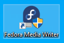

3. Z menu programu możemy wybrać wersję Fedory, jaką można zainstalować lub wskazać pobrany wcześniej obraz ISO.

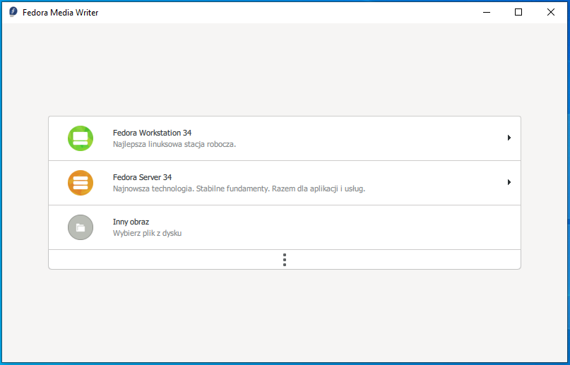

4. W przypadku wybrania konkretnej wersji pojawi się opis szczegółowy wraz z przyciskiem "Utwórz Live USB" - klikamy na niego.

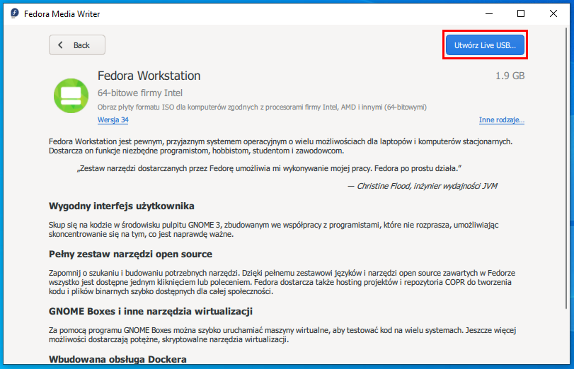

5. Wybieramy nośnik z listy [1] i klikamy na przycisk "Zapisz na dysk" [2].

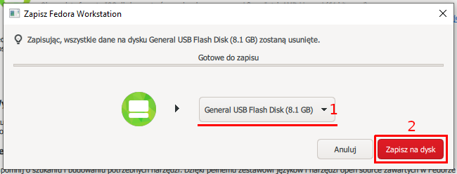

6. Program rozpoczyna pracę - dokonane zostanie formatowanie nośnika, skopiowanie obrazu na nośnik i jego weryfikacja.

7. Po ukończeniu tworzenia bootowalnego pendrive, można zamknąć okno programu i użyć nośnik w celu przetestowania bądź instalacji systemu.

## Linux

### Ventoy
todo

### Balena Etcher
todo

### dd
todo

## Płyta DVD
Jeśli preferujesz wypalenie płyty DVD - nic nie stoi na przeszkodzie. Możesz użyć dowolnego oprogramowania do wypalania płyt z obsługą obrazów ISO.