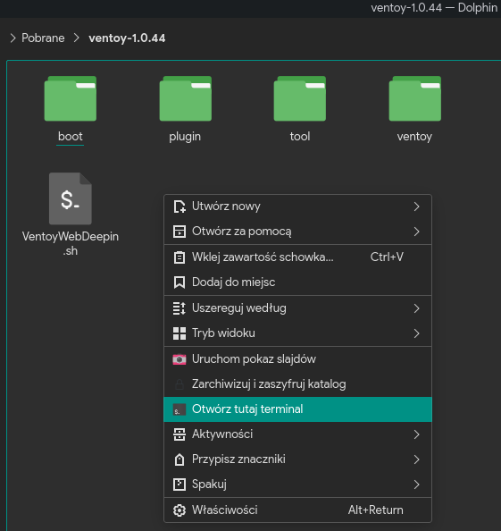
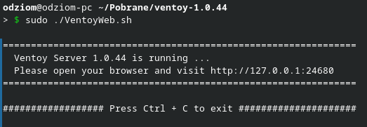
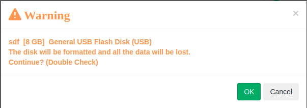
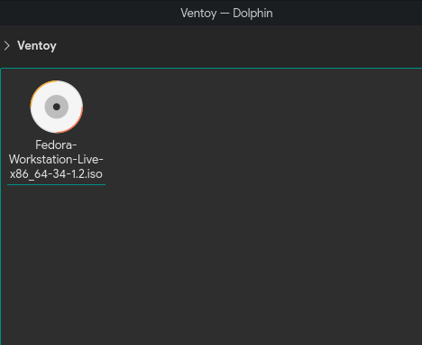
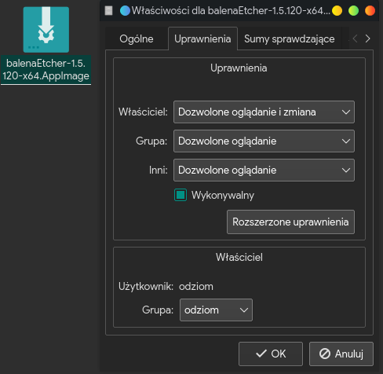
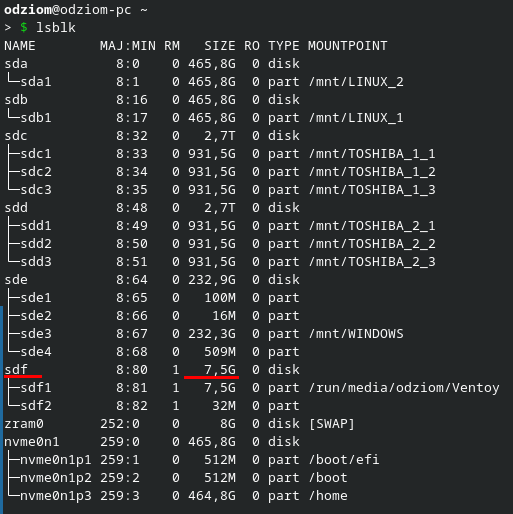

# 1.2 Przygotowanie nośnika
Poniżej znajdziesz szczegółowy opis tworzenia nośników USB w celu instalacji systemu Fedora.

## Windows

### Rufus
1. Pobierz oprogramowanie Rufus z oficjalnej strony: [https://rufus.ie/](https://rufus.ie/)
2. Uruchom program Rufus.


3. Wybierz pendrive, na którym ma zostać umieszczony obraz ISO [1]. Wybierz obraz ISO, który ma zostać umieszczony na pendrive [2]. Po wybraniu nośnika i obrazu systemu, kliknij na przycisk START [3].


4. Na zapytanie o obraz "ISOHybrid" odpowiadamy twierdząco z domyślną opcją "Zapisz w trybie Obraz ISO (zalecane)".


5. Na zapytanie dotyczące pobrania Syslinux również odpowiadamy twierdząco.


6. Rufus zapyta o format nośnika - jeśli jesteśmy pewni, potwierdzamy OK.


7. Rufus rozpoczyna przygotowanie bootowalnego pendrive. To może chwilę potrwać w zależności od zastosowanego nośnika.

8. Gdy Rufus zakończy przytowania można zamknąć okno programu i użyć nośnik w celu przetestowania bądź instalacji systemu.

### Balena Etcher
1. Pobieramy i instalujemy oprogramowanie Balena Etcher ze strony: [https://www.balena.io/etcher/](https://www.balena.io/etcher/)
2. Uruchamiamy program Balena Etcher.


3. W głównym menu wybieramy opcję "Flash from file" i wskazujemy plik z obrazem ISO.


4. Gdy obraz zostanie wybrany, klikamy na przycisk "Select target".


5. Wskazujemy pendrive, który ma zostać wykorzystany i potwierdzamy decyzję przyciskiem "Select".


6. Po dokonaniu wyboru klikamy na przycisk "Flash!" w celu rozpoczęcia.


7. Program rozpoczyna pracę - dokonane zostanie formatowanie nośnika, skopiowanie obrazu na nośnik i jego weryfikacja.


8. Po ukończeniu tworzenia bootowalnego pendrive, można zamknąć okno programu i użyć nośnik w celu przetestowania bądź instalacji systemu.


### Ventoy
1. Pobieramy plik zip przeznaczony dla systemu Windows z tej strony: [https://www.ventoy.net/en/download.html](https://www.ventoy.net/en/download.html)
2. Rozpakowujemy plik zip i przechodzimy do rozpakowanego katalogu.
3. Uruchamiamy plik Ventoy2Disk.exe


4. Wybieramy nośnik z listy [1] i klikamy na przycisk "Install" [2].


5. Ventoy zapyta się o sformatowanie nośnika pierwszy raz - potwierdzamy.


6. Dla pewności Ventoy zada ponownie to pytanie - ponownie potwierdzamy.


7. Ventoy rozpoczyna przygotowanie środowiska dla bootowalnego pendrive. Sukces zostanie oznajmiony stosownym komunikatem.


8. W celu umieszczenia obrazu ISO na utworzonym nośniku otwieramy Eksplorator Windows. Odszukujemy pendrive z etykietą Ventoy i otwieramy go.


9. Kopiujemy plik ISO na nośnik.


10. Po zakończeniu kopiowania można użyć nośnik w celu przetestowania bądź instalacji systemu.

### Fedora Media Writer
1. Pobieramy i instalujemy Fedora Media Writer ze strony: [https://getfedora.org/pl/workstation/download/](https://getfedora.org/pl/workstation/download/)

2. Uruchamiamy program Fedora Media Writer.


3. Z menu programu możemy wybrać wersję Fedory, jaką można zainstalować lub wskazać pobrany wcześniej obraz ISO.


4. W przypadku wybrania konkretnej wersji pojawi się opis szczegółowy wraz z przyciskiem "Utwórz Live USB" - klikamy na niego.


5. Wybieramy nośnik z listy [1] i klikamy na przycisk "Zapisz na dysk" [2].


6. Program rozpoczyna pracę - dokonane zostanie formatowanie nośnika, skopiowanie obrazu na nośnik i jego weryfikacja.

7. Po ukończeniu tworzenia bootowalnego pendrive, można zamknąć okno programu i użyć nośnik w celu przetestowania bądź instalacji systemu.

## Linux

### Ventoy
1. Pobieramy plik zip przeznaczony dla systemu Linux z tej strony: [https://www.ventoy.net/en/download.html](https://www.ventoy.net/en/download.html)
2. Rozpakowujemy plik tar.gz i przechodzimy do rozpakowanego katalogu.
3. Klikamy prawym przyciskiem myszy na puste pole menedżera plików i wybieramy opcję **Otwórz tutaj terminal** lub podobnie brzmiącą.
Jeśli nie ma tej opcji do wyboru, otwórz terminal i przejdź do katalogu z rozpakowanym Ventoyem.



4. Uruchamiamy plik VentoyWeb.sh z uprawnieniami roota.
```
sudo ./VentoyWeb.sh
```

5. Przechodzimy na stronę wskazaną w terminalu - najczęściej http://127.0.0.1:24680



6. Po załadowaniu strony wybieramy pendrive [1] i klikamy przycisk Install [2].


7. Ventoy zapyta się o sformatowanie nośnika pierwszy raz - potwierdzamy.


8. Dla pewności Ventoy zada ponownie to pytanie - ponownie potwierdzamy.



9. Czekamy do ukończenia procesu tworzenia bootowalnego pendrive.

10. Przechodzimy do utworzonego pendrive'a o etykiecie Ventoy i kopiujemy obraz systemu.



11. Po zakończeniu kopiowania można użyć nośnik w celu przetestowania bądź instalacji systemu.

### Balena Etcher
1. Pobieramy oprogramowanie Balena Etcher dla Linux ze strony: [https://www.balena.io/etcher/](https://www.balena.io/etcher/)
***
INFORMACJA

W niektórych dystybucjach Balena Etcher może być do zainstalowania z poziomu repozytorium. Polecam zapoznać się z dostępnymi pakietami repozytorium twojej dystrybucji.
***

2. Rozpakowujemy pobrany plik, przechodzimy do katalogu z Balena Etcher i uruchamiamy plik balenaEtcher-1.5.120-x64.AppImage.

3. (Opcjonalnie) Jeśli plik nie ma uprawnień do uruchomienia - klikamy na nim prawym przyciskiem myszy, wybieramy **Właściwości**. W zakładce **Uprawnienia** zaznaczamy opcję **Wykonywalny** lub podobną. Zapisujemy zmiany i ponownie uruchamiamy plik.



4. W głównym menu wybieramy opcję "Flash from file" i wskazujemy plik z obrazem ISO.


5. Gdy obraz zostanie wybrany, klikamy na przycisk "Select target".


6. Wskazujemy pendrive, który ma zostać wykorzystany i potwierdzamy decyzję przyciskiem "Select".


7. Po dokonaniu wyboru klikamy na przycisk "Flash!" w celu rozpoczęcia.


8. Program rozpoczyna pracę - dokonane zostanie formatowanie nośnika, skopiowanie obrazu na nośnik i jego weryfikacja.


9. Po ukończeniu tworzenia bootowalnego pendrive, można zamknąć okno programu i użyć nośnik w celu przetestowania bądź instalacji systemu.


### dd
***
UWAGA!

To jest najbardziej zaawansowana metoda zapisu, używać z rozwagą!
***
1. Podłącz pendrive i otwórz terminal.

2. Zlokalizuj podłączony pendrive:
```
lsblk
```

W przykładzie jest to **8GB** pendrive oznaczony jako **sdf**.



3. Przejdź do katalogu, gdzie pobrany został obraz systemu komendą **cd**.
Jeśli przykładowo umieściłeś go w katalogu **Pobrane** wykonaj komendę:
```
cd Pobrane
```

4. Uruchom program dd z uprawnieniami administratora, aby rozpocząć kopiowanie.
Składnia programu jest następująca:
```
sudo dd if=<nazwa_pliku_iso> of=/dev/sdX bs=1024k status=progress
```
- parametr if - wzkazuje nazwę pliku iso, na przykład **Fedora-Workstation-Live-x86_64-34-1.2.iso** (polecam nazwę bez spacji!)
- parametr of - to zlokalizowany pendrive, gdzie sdX to konkretny identyfikator nośnika
- parametry bs oraz status pozostawiamy bez zmian

Poniżej przykład komendy:
```
sudo dd if=Fedora-Workstation-Live-x86_64-34-1.2.iso of=/dev/sdf bs=1024k status=progress
```

5. Po zakończeniu kopiowania można użyć nośnik w celu przetestowania bądź instalacji systemu.


## Płyta DVD
Jeśli preferujesz wypalenie płyty DVD - nic nie stoi na przeszkodzie. Możesz użyć dowolnego oprogramowania do wypalania płyt z obsługą obrazów ISO.