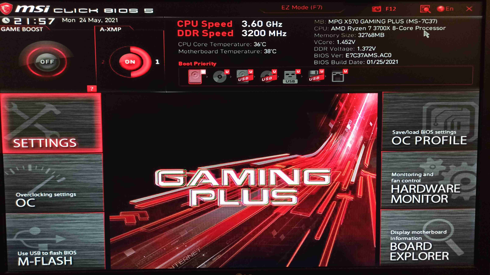
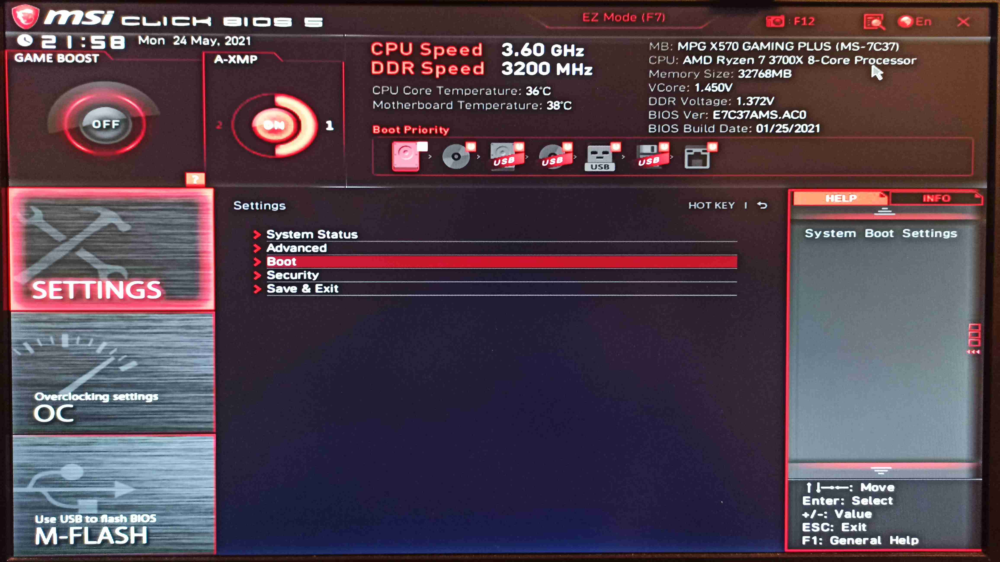
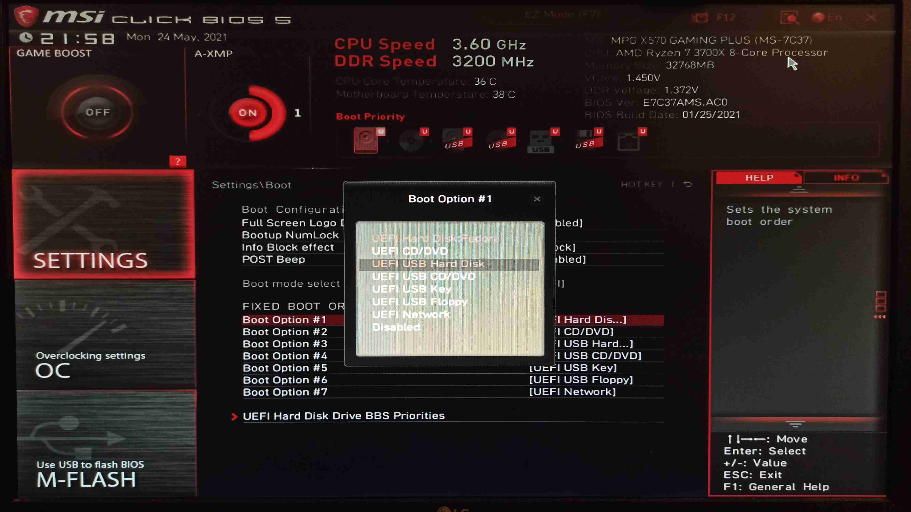

# 1.3 Konfiguracja BIOS/UEFI
Przed instalacją systemu Fedora istnieje prawdopodobieństwo, iż zajdzie potrzeba odpowiedniej konfiguracji oprogramowania układowego płyty głównej.
W tym celu należy uruchomić ponownie komputer i po pojawieniu się ekranu POST (ang. Power On Self-Test) wcisnąć klawisz lub kombinację klawiszy odpowiadającą za wejście do BIOS/UEFI.

Najczęściej używane klawisze lub kombinacje klawiszy:
- Delete
- F2
- F1
- Fn + F2
- Esc
- Enter, a następnie F2 (niektóre laptopy Lenovo)

***
UWAGA!

Producenci płyt głównych oraz laptopów stosują różne układy menu.

Przedstawione poniżej zdjęcia są poglądowe i mogą być inne w zależności od sprzętu.

W przypadku problemu ze zlokalizowaniem odpowiednich opcji poproś osobę doświadczoną o pomoc.

Poniżej zostaną wypisane wszystkie możliwe, alternatywne nazwy opcji, które można spotkać w oprogramowaniu układowym.
***

## UEFI

### Sekwencja bootowania
1. Po uruchomieniu oprogramowania układowego pierwszy raz najprawdopodobniej będziesz musiał wejść do opcji zaawansowanych (Advanced). Poszukaj takowej opcji i kliknij lub wciśnij przypisany klawisz.

2. Odszukujemy opcję, która jest odpowiedzialna za ustawienia (Settings).
Czasami nie jest to konieczne, w zależności od producenta płyty głównej i układu menu.

3. Odnajdujemy opcję odpowiedzialną za ustawienie sekwencji bootowania nośników (przykładowe nazwy opcji: "Boot", "Boot Sequence", "Boot Priority")

4. Wybieramy pierwszą opcję z listy (tu nazwana "Boot Option #1").

5. Wybieramy który nośnik ma być ustawiony jako pierwszy - jako że interesuje nas pendrive to wybieramy opcję z "USB" w nazwie. Jeśli nie jest to menu wybieralne wtedy najprawdopodobniej należy posłużyć się klawiszami - najczęściej spotykanymi są: Page Up i Page Down lub + i - lub F5 i F6.

6. Po upewnieniu się, że sekwencja jest prawidłowa można zapisać zmiany.

### Secure Boot
W przypadku trybu UEFI zalecane jest wyłączenie opcji Secure Boot.
1. Wejdź do UEFI, w ustawienia i odszukaj opcji powiązanych z konfiguracją UEFI/CSM lub Windows OS Configuration (nazewnictwo może się różnić w zależności od płyty głównej).

2. Po odnalezieniu opcji "Secure Boot" wyłącz ją (ustawienie "Disabled").

3. Zapisz zmiany.

### Inne opcje utrudniające instalację systemu

Poniżej znajduje się lista opcji, które mogą spowodować spore problemy przy uruchomieniu bootowalnego pendrive bądź instalacji systemu:
- "Fast Boot" - może powodować całkowite pominięcie sekwencji bootowania
- "SATA Mode" - ustawione jako "RAID" lub "RST with Optane" lub "RST without Optane" - może powodować problemy z instalacją - najczęściej dotyczy to braku sterownika kontrolera RAID (bardzo rzadko) lub technologii Intel Rapid Storage Technology (dość często spotykane w nowszych laptopach lub płytach głównych z wykorzystaniem dysku NVMe od Intela).
- "Quiet Boot" - podobny objaw do "Fast Boot", najczęściej pomija sekwencję bootowania z innych nośników, dodatkowo nie wyświetlając komunikatów na ekranie.

## BIOS (aka. Legacy)

### Sekwencja bootowania
1. Po uruchomieniu BIOSu ustawienia sekwencji uruchamiania nośników powinna znajdować się w zakładce **Boot**.
W przypadku tej płyty głównej ustawienie nazywa się **Boot Device Priority** - inne nazwy to **Boot**, **Boot Sequence**, **Boot Priority**.

2. Po wejsciu w powyższą opcję ustawiamy kolejność dysków - na pierwszym miejscu musi znaleźć się urządzenie, z którego mamy rozpocząć instalację systemu - może być to **Removable**, **USB**, **DVD-Drive**, etc.

Ostatecznie lista powinna wyglądać podobnie jak na zdjęciu poniżej:

3. Na koniec przechodzimy do sekcji "Exit" i wychodzimy z BIOSu zapisując zmiany. Można też skorzystać ze skrótu klawiszowego - najczęściej klawisz F10.

### Uwaga dodatkowa
Tak jak w przypadku UEFI może się zdarzyć, że należy zmienić tryb pracy dysku SATA. W tym celu przechodzimy do zakładki Advanced i w dziale Onboard Device Configuration ustawiamy SATA Controller Mode na IDE lub AHCI. Przykładowy screen poniżej:

Po zmianie ustawienia wychodzimy z BIOSu zapisując konfigurację.