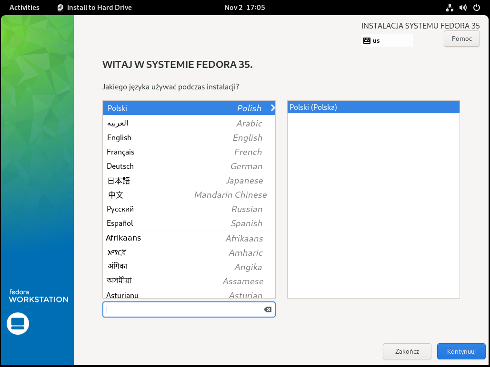
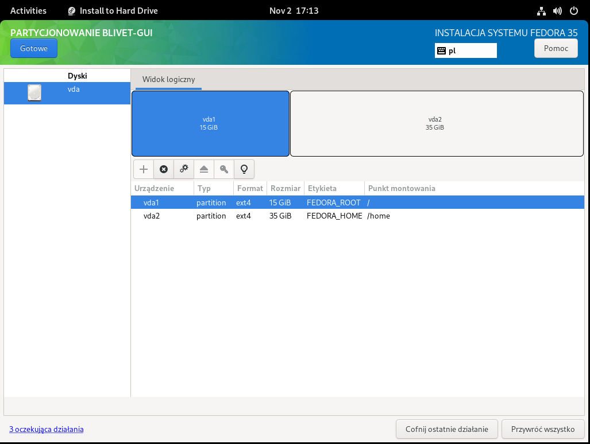
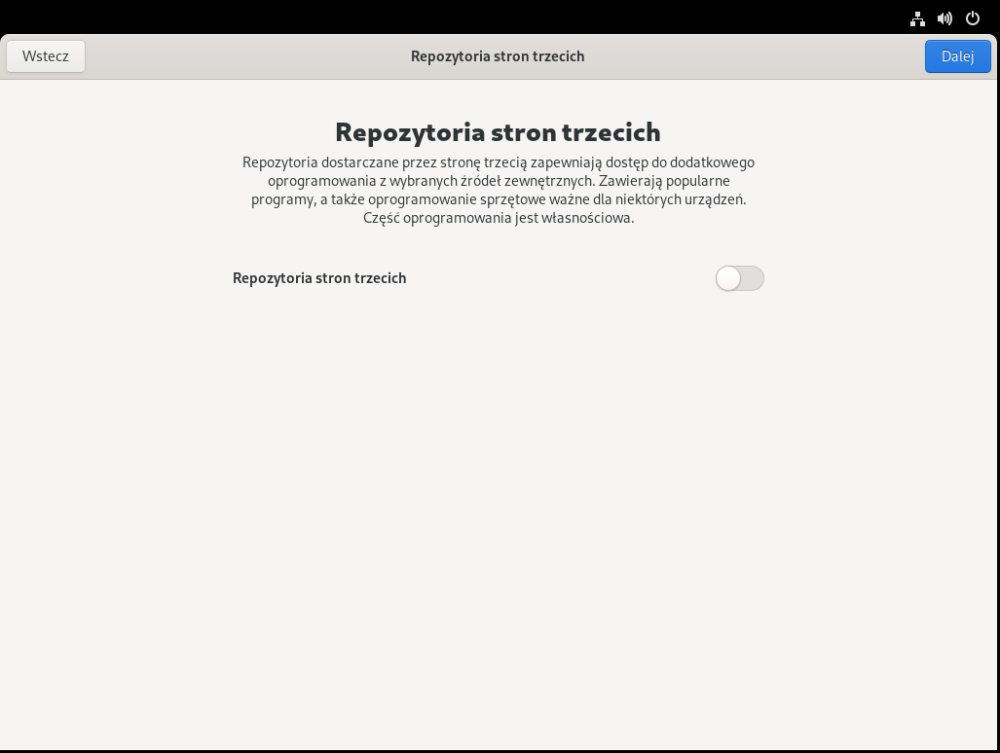
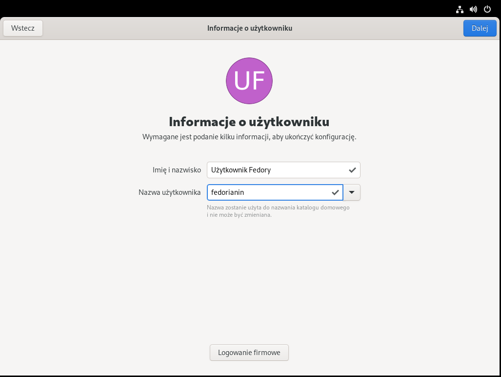

# 1.4 Instalacja systemu Fedora 35
Ten rozdział pokaże ci krok po kroku jak zainstalować Fedorę na komputerze.
Na potrzeby tego poradnika wybrano standardową wersję, która jest najchętniej wybierana wśród użytkowników. Oparta o środowisko graficzne Gnome 41.
Istnieją również inne środowiska graficzne, w tym przeznaczone dla słabszych komputerów - ich spis znajdziesz w rozdziale 1.1.

***
UWAGA!

Proces instalacji może się różnić w przypadku wybrania innego środowiska graficznego niż przedstawiony w tym rozdziale.
***

1. Po uruchomieniu komputera z płyty DVD lub dysku USB na ekranie powinno pojawić się menu uruchomieniowe systemu. Wybierz jedną z dwóch dostępnych opcji. Pierwsza opcja uruchomi nośnik od razu, druga - poprzedzi uruchomienie weryfikacją poprawności danych na nośniku (w przypadku płyty DVD lub wolnego nośnika USB może to trochę potrwać).

***
UWAGA!

Jeśli nośnik nie uruchomił się, sprawdź ustawienia kolejności bootowania nośników w BIOS/UEFI lub skorzystaj z Boot Menu, jeśli twoja płyta główna posiada taką opcję.

Pomoc odnośnie konfiguracji BIOS/UEFI znajdziesz w rozdziale **1.3 Konfiguracja BIOS**
***

2. Po uruchomieniu nośnika ukaże się okno powitalne, w którym możesz przetestować dystrybucję lub ją zainstalować. W tym poradniku przestawiona została instalacja, więc sugerujemy, abyś wybrał opcję **Install to Hard Drive**.

3. Uruchomienie instalatora pozwoli ci wybrać język systemu podczas instalacji. Po wybraniu kliknij na przycisk **Kontynuuj**.

4. W kolejnym kroku możesz dostosować ustawienia instalowanego systemu. Ustawienie dotyczące języka instalatora automatycznie sugeruje domyślne wartości dla klawiatury oraz daty i czasu. Możesz te ustawienia zmienić w tym momencie (patrz punkt 5 i 6) lub pozostać przy sugerowanych (przeskocz do punktu 7).

5. Po wybraniu ustawień klawiatury możesz dodać lub usunąć układy klawiatury. Kliknij na przycisk **+**, aby dodać układ, **-**, aby usunąć, przyciski **˄** i **˅** przestawiają ich kolejnosć. Z prawej strony możesz przetestować wybrany układ klawiatury. Po zakończeniu kliknij na przycisk **Gotowe**.

6. Po wybraniu ustawień daty i czasu możesz wskazać obowiązującą strefę czasową, jak również zarządzać ustawieniami czasu sieciowego. Po zakończeniu kliknij na przycisk **Gotowe**.

7. Po wybraniu opcji **Miejsce docelowe instalacji** rozpocznie się partycjonowanie dysku twardego.

***
UWAGA!

Partycjonowanie dysku jest najtrudniejszym momentem instalacji, który poważnie ingeruje w dane znajdujące się na dysku twardym. W przypadku instalacji obok Windowsa i/lub gdy instalujesz system pierwszy raz koniecznie wykonaj kopię zapasową danych!

Nieprawidłowe użycie może spowodować utratę zapisanych danych. Każdą akcję podejmujesz na własną odpowiedzialność!
***

Partycjonowanie dysku można wykonać w trzech wariantach:
- automatycznym,
- niestandardowym,
- zaawansowanym.

## Tryb automatyczny

Tryb automatyczny rozdysponuje wolne miejsce na dysku. Wystarczy, że wybierzesz dysk lub dyski i klikniesz na przycisk **Gotowe**. Jeśli wszystko powiedzie się, instalator pozwoli kontynuować instalację.

## Tryb niestandardowy

Tryb niestandardowy pozwoli tobie samodzielnie - za pomocą kreatora - rozdysponować miejsce na dysku. Wybierz dysk lub dyski, zaznacz opcję **Niestandardowa** i kliknij na przycisk **Gotowe**, aby przejść do kolejnego kroku.

W kolejnym kroku wyświetli się lista zainstalowanych systemów (o ile takowe istnieją) oraz sugestia utworzenia nowej partycji i punktu montowania.

Do wyboru są następujące opcje:
- standardowa partycja (ext4 lub fat32 dla EFI)
- Btrfs (domyślnie wybierany w Fedorze)
- LVM
- Cienkie zabezpieczanie LVM

Po wybraniu jednej z opcji klikamy na przycisk **+**.

**Na potrzeby tego poradnika wybierzemy standardową partycję ext4.**

Warto wspomnieć jak należy przydzielić miejsce na dysku.

Jeśli uruchomiłeś instalator w trybie UEFI należy utworzyć minimum dwie partycje:
- **partycja główna, root** - z punktem montowania **/** - format partycji **ext4** - **rozmiar dowolny (minimum 15 GB)**
- **partycja uruchomieniowa EFI** - z punktem montowania **/boot/efi** - format partycji **fat32** - rozmiar zalecany **512 MB**

Jeśli uruchomiłeś instalator w trybie BIOS/Legacy wystarczy utworzyć jedną partycję:
- **partycja główna, root** - z punktem montowania **/** - format partycji **ext4** - **rozmiar dowolny (minimum 15 GB)**

Opcjonalnie możesz wydzielić inne partycje - między innymi **dla katalogu domowego**. Należy utworzyć takową partycję z formatowaniem **ext4** o dowolnej wielkości i wskazać punkt montowania **/home**.

W przypadku słabszych komputerów z małą pojemnością pamięci operacyjnej zalecane jest wydzielenie **przestrzeni wymiany (swap)**.

Zdjęcie poniżej przedstawia przykładowy końcowy efekt partycjonowania dysku metodą niestandardową w trybie BIOS/Legacy.

W przypadku pomyłki w partycjonowaniu możesz zawsze wyedytować wartości w po prawej stronie lub usunąć partycję klikając na przycisk **-**.

Po zakończeniu partycjonowania klinij na przycisk **Gotowe**. Jeśli dokonane zmiany są prawidłowe, instalator pozwoli kontynuować instalację.

## Tryb zaawansowany

Po uruchomieniu opcji zaawansowanej pojawi się narzędzie **BLIVET-GUI** służące do zarządzania dyskami ficzycznymi i logicznymi. Tu możesz dokonywać zmian na różne sposóby, których opisanie w tym poradniku jest zbyt obszerne. Dlatego też poniżej umieszczone są trzy kluczowe zrzuty ekranu.

Okno główne BLIVET-GUI:

Tworzenie partycji - przykładowo wypełniony formularz:

Przykładowy końcowy efekt partycjonowania dysku metodą zaawansowaną w trybie BIOS/Legacy:

Po zakończeniu partycjonowania kliknij na przycisk **Gotowe**. Jeśli dokonane zmiany są prawidłowe, instalator pozwoli kontynuować instalację.

8. Jeśli wszystkie opcje instalatora - **Klawiatura, Data i czas oraz Miejsce docelowe instalacji** - są poprawne, kliknij na przycisk **Rozpocznij instalację**.

9. Instalator rozpocznie kopiowanie plików i wstępną konfigurację systemu. **To może potrwać od kilku do kilkudziesięciu minut w zależności od nośnika i sprzętu.**

10. Po zainstalowaniu kliknij na przycisk **Ukończ instalację**.

11. Uruchom ponownie komputer - przy uruchomieniu ponownym **wyciągnij płytę DVD z napędu lub odłącz podłączony pendrive**.

12. Przy pierwszym uruchomieniu systemu pojawi się **Konfigurator systemu Fedora** - kliknij przycisk **Rozpocznij konfigurację**.

13. W kolejnym kroku możesz zezwolić na ustalanie położenia geograficznego urządzenia i automatyczne zgłaszanie problemów dla deweloperów. Obie opcje są dobrowolne i można z nich zrezygnować. Po dokonaniu ustawień według własnych preferencji - kliknij przycisk **Dalej**.

14. Nowością w instalatorze Fedora 35 jest możliwość uruchomienia repozytoriów zewnętrznych. Są one źródłem dodatkowego oprogramowania, domyślnie niedostępnego w systemie Fedora - w tym sterownika do kart graficznych NVidia. Zaznaczenie opcji **Repozytoria stron trzecich** doda do systemu repozytoria:
- Copr repo for PyCharm owned by phracek
- repozytorium Google Chrome
- repozytorium RPM Fusion - Nonfree - NVIDIA Driver
- repozytorium RPM Fusion - Nonfree - Steam

***
UWAGA!

Dodane repozytorium RPM Fusion NIE JEST jego pełną zawartością. Aby je uzupełnić po instalacji sprawdź rozdział 2.3.
***

Jeśli posiadasz kartę graficzną NVidia lub korzystasz z oprogramowania - PyCharm, Google Chrome lub Steam, możesz zaznaczyć tę opcję.Po dokonaniu własciwego wyboru kliknij przycisk **Dalej**.

15. Następnie możesz połączyć system Fedora z kontami online. Jeśli nie chcesz tego robić - kliknij przycisk **Pomiń**.

***
UWAGA!

W porównaniu do wersji 34 w Fedorze 35 zniknęła opcja zalogowania do Facebooka.
***

16. Teraz masz możliwość utworzenia nowego użytkownika tego systemu - wpisz Imię i nazwisko (lub ksywkę) oraz nazwę użytkownika, a następnie kliknij przycisk **Dalej**.

17. Ustaw hasło wpisując je dwukrotnie. Możesz sugerować się **wskaźnikiem siły wpisanego hasła.** W przypadku, gdy hasło jest zbyt słabe konfigurator może dopytać o potwierdzenie użycia słabego hasła. Kliknij przycisk **Dalej**, aby kontynuować.

18. Konfiguracja została ukończona, możesz kliknąc na przycisk **Rozpocznij używanie systemu Fedora Linux**.

19. Po chwili pojawi się samouczek do środowiska Gnome w wersji 41. Możesz go **przejrzeć** lub **pominąć**.

20. **Gratuluję!** Udało ci się zainstalować system Fedora! Teraz możesz rozpocząć korzystanie z systemu.

***
UWAGA!

Jeśli posiadasz kartę graficzną **NVidia** **koniecznie** zajrzyj do rozdziału **2.6 Sterowniki wideo**! Tam dowiesz się jak zainstalować sterowniki NVidia, aby osiągnąć większą wydajność.
*** 

