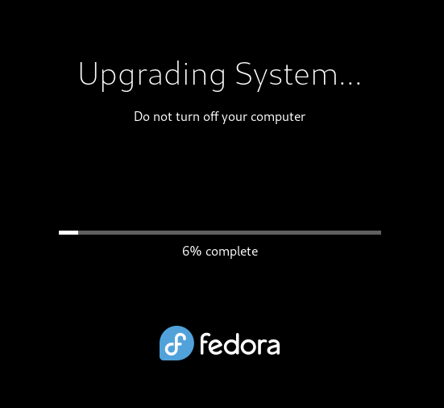

# 1.5 Aktualizacja systemu Fedora do wersji 35
Ten rozdział pokaże ci krok po kroku jak zaktualizować Fedorę 34 do wersji 35.
Proces aktualizacji przebiega w kilku prostych krokach. Do wykonania tej procedury potrzebne jest konto z uprzywilejowaniami administratora.

## Proces pełnej aktualizacji systemu Fedora

1. Przed rozpoczęciem należy zaktualizować obecnie zainstalowane pakiety w systemie Fedora 34.
   Do tego celu użyj komendy:
   ```
   sudo dnf upgrade --refresh
   ```

2. Usuń wszystkie nieużywane pakiety przy pomocy komendy:
   ```
   sudo dnf autoremove
   ```

3. Proces aktualizacji systemu wymaga zainstalowania paczki ```dnf-plugin-system-upgrade```. Zainstaluj ją komendą:
   ```
   sudo dnf install dnf-plugin-system-upgrade
   ```

4. Aby rozpocząć proces aktualizacji systemu należy wykonać komendę:
   ```
   sudo dnf system-upgrade download --releasever=35
   ```
   System zapyta się, czy na pewno wykonana została aktualizacja wszystkich pakietów w systemie. Jeśli tak, odpowiedz twierdząco wciskając odpowiedni klawisz i potwierdzając Enterem.

5. Po dłuższej chwili system zasugeruje pakiety jakie zostaną pobrane - ich ilość oraz całkowity rozmiar pobierania. Potwierdź chęć pobierania wciskając odpowiedni klawisz i potwierdzając Enterem.

6. Rozpoczyna się pobieranie. W zależności od posiadanego łącza może to potrwać od kilku do kilkudziesięciu minut.

7. System zapyta o import klucza (lub kilku kluczy) - odpowiedz na wszystkie twierdząco.

8. Aby rozpocząć właściwy proces aktualizacji systemu uruchom ponownie system przy pomocy komendy:
   ```
   sudo dnf system-upgrade reboot
   ```
   Na ekranie pojawi się wskaźnik postępu. Podczas pracy nie można wyłączać komputera.
   

9. Jeśli proces aktualizacji powiedzie się możesz cieszyć się zaktualizowaną Fedorą do wersji 35.

## Rozwiązywanie problemów
Jak w każdym większym procesie aktualizacji nie wszystko może się udać. W tym celu zebrałem spotkane przeze mnie problemy mające miejsce w trakcie aktualizacji systemu.

### Problem 1
System nie rozpoczął aktualizacji po wpisaniu komendy ```sudo dnf system-upgrade reboot```.
Komputer uruchomił się ponownie, mignął oknem aktualizacji, po czym uruchomił wersję 34.
### Rozwiązanie 1
Należy przeczytać logi przy pomocy komendy ```journalctl -xe```

Jeśli znajduje się tam wpis:
```
Problem: Działanie spowodowałoby usunięcie tych chronionych pakietów:
```
Rozwiązaniem może okazać się ponowne uruchomienie komendy:
```
sudo dnf system-upgrade download --releasever=35
```
