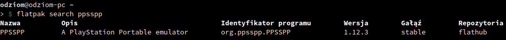
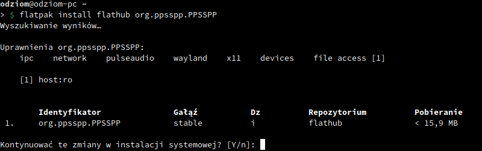
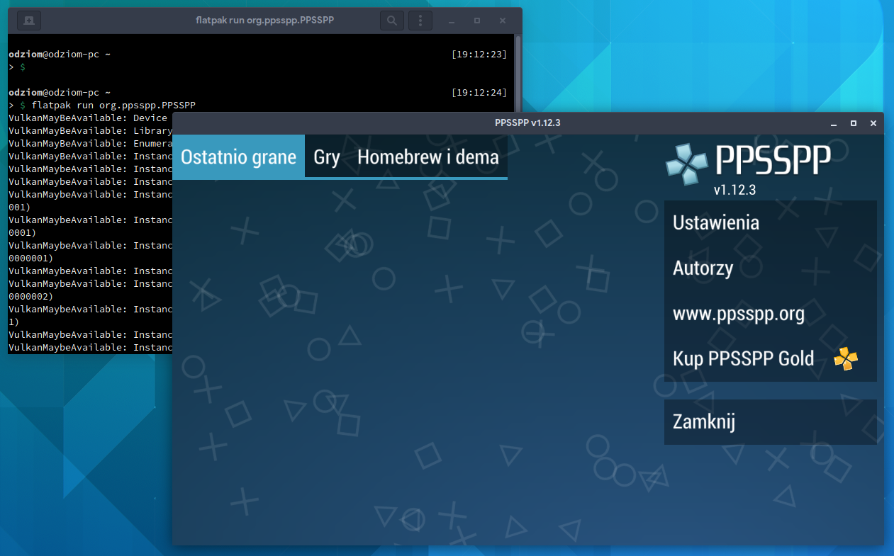

# 2.5 Flatpak - jako alternatywna forma instalacji oprogramowania

## O Flatpaku słów kilka
Oprócz wspomnianego w poprzednich rozdziałach dnf warto wspomnieć o przyszłościowej alternatywie dla tradycyjnych menedżerów pakietów.

**Flatpak** - opracowany w ramach projektu **freedesktop.org** - jest narzędziem do wdrażania oprogramowania i zarządzania pakietami w systemie Linux. Pakiety Flatpak są **"uniwersalne"**, gdyż proces ich dostarczania i aktualizacji nie wymaga **tworzenia paczek** i ich **testów** dla **każdej dystrybucji** z osobna. Aplikacje Flatpak wymagają nadanych uprawnień, aby przykładowo móc korzystać z urządzeń Bluetooth, dźwięku, sieci, etc.. Użytkownik systemu ma **pełną kontrolę** nad instalowanymi pakietami i w każdej chwili może **dodawać lub ograniczać uprawnienia**. Środowisko **sandbox** pozwala uruchamiać je **niezależnie** od reszty systemu.

## Flatpak w Fedora
Flatpak w dystrybucji Fedora jest domyślnie instalowany w systemie. Domyślnie aplikacje dostarczane są z repozytorium **"Fedora Flatpaks"**.

## Flathub - największa baza oprogramowania Flatpak
"Fedora Flatpaks" mimo wspaniałego założenia dostarczania oprogramowania w bezinwazyjny sposób nie zachwyca ilością dostępnych aplikacji. Dobrym pomysłem jest dodanie repozytorium **Flathub**.

Istnieją dwie gałęzie repozytorium Flathub - **stable** i **beta**. Oba repozytoria uzupełniają się, więc w przypadku chęci posiadania oprogramowania z gałęzi beta warto również dodać gałąź stable.

Flathub Stable dodasz przy pomocy komendy:
```
flatpak remote-add flathub https://flathub.org/repo/flathub.flatpakrepo
```

Flathub Beta dodasz przy pomocy komendy:
```
flatpak remote-add flathub-beta https://flathub.org/beta-repo/flathub-beta.flatpakrepo
```

## Podstawy obsługi Flatpak
Zarządzanie oprogramowaniem odbywa się przy pomocy **menedżera oprogramowania** zależnego od zainstalowanego środowiska graficznego - w Gnome będzie to **Gnome Software**, w KDE będzie to **Discover (Odkrywca)** - lub **z terminala** przy pomocy komendy ```flatpak```.

Jako że instalacja oprogramowania przez graficzny interfejs ogranicza się do wyszukania programu i kliknięcia przycisku "Zainstaluj" pozwoliłem sobie pominąć ten sposób, aby skupić się na wierszu poleceń.

Aby wyszukać pakiet w repozytoriach Flatpak użyj polecenia:
```
flatpak search <fraza>
```
W wyniku wyszukiwania pojawi się lista pakietów z wyszukiwaną frazą.



W tabeli istotne są kolumny **Identyfikator programu** oraz **Repozytoria**

Aby zainstalować program użyj polecenia:
```
flatpak install <repozytorium> <identyfikator.programu>
```
Przykład poniżej dla programu PPSSPP:
```
flatpak install flathub org.ppsspp.PPSSPP
```
Po wpisaniu komendy system zapyta o dokonanie zmian - odpowiadamy twierdząco i czekamy na zainstalowanie oprogramowania.



Zainstalowane oprogramowanie możesz uruchomić tradycyjnie **z menu środowiska graficznego** lub **z terminala**. Jednak uruchamianie oprogramowania Flatpak w terminalu wygląda nieco inaczej. Aby uruchomić program należy znać **identyfikator programu** i wykonać komendę według schematu poniżej:
```
flatpak run <identyfikator.programu>
```
Dla przykładu:
```
flatpak run org.ppsspp.PPSSPP
```



Jeśli nie pamiętasz co masz zainstalowane w systemie jako Flatpak możesz skorzystać z wyświetlenia listy za pomocą komendy:
```
flatpak list --app
```
Znajdziesz tu między innymi identyfikator programu, który będzie potrzebny przy uruchamianiu aplikacji.

Aby usunąć program skorzystaj z komendy:
```
flatpak uninstall <identyfikator.programu>
```

Aby zaktualizować oprogramowanie skorzystaj z komendy:
```
flatpak update
```
lub dla pojedynczego programu
```
flatpak update <identyfikator.programu>
```

Szczegóły o oprogramowaniu otrzymasz wpisując komendę:
```
flatpak info <identyfikator.programu>
```