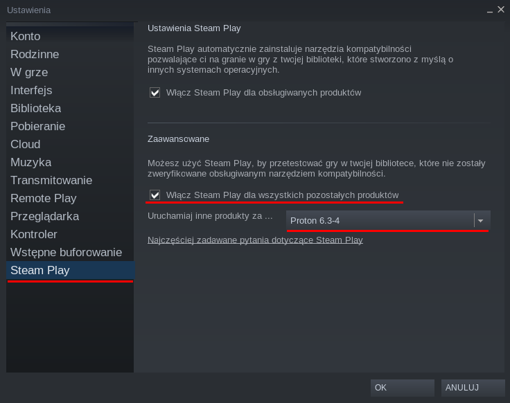
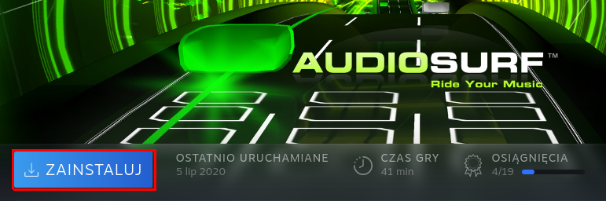

# 3.5 Proton - uruchamianie gier dla systemu Windows na platformie Steam

## Czym jest Proton?
Proton jest narzędziem (forkiem Wine) wykorzystywanym w kliencie Steam. Pozwala on uruchomić gry dedykowane dla systemu Windows pod dystrybucjami Linuksa.

## Jak użyć Protona w Steam?
Domyślnie Proton uruchamiany jest wraz z wąską listą gier (choć ta ciągle się powiększa). Istnieje możliwość uruchomienia wszystkich gier dedykowanych pod Windows w środowisku Proton. W tym celu należy wykonać kilka kroków.

1. Uruchom Steam i wejdź do Ustawień.
2. Z menu po lewej wybierz opcję "Steam Play"
3. W sekcji "Zaawansowane" zaznacz "Włącz Steam Play dla wszystkich pozostałych produktów".
4. Wybierz wersję Protona, którą chcesz wykorzystać - zalecany najnowszy Proton (Experimental należy użyć w wyjątkowych przypadkach).

5. Zastosować zmiany i zrestartować Steam.

## Instalacja gier z użyciem Proton
Instalacja gier z użyciem Proton jest prosta. Wystarczy wejść do biblioteki, wybrać interesującą pozycję i kliknąć na przycisku "Zainstaluj".

W zależności od gry należy wskazać lokalizację instalacji i zaakceptować umowę licencyjną. Rozpocznie się pobieranie gry, a po chwili będzie ją można uruchomić tak jak każdą inną grę na Steam.

## Moja gra nie działa! Co robić?
Polecam skorzystać z obszernej bazy danych użytkowników Steam - **ProtonDB**

[https://www.protondb.com/](https://www.protondb.com/)

Na tej stronie można wyszukać grę, a w znalezionym wpisie przeczytać o problemach, sugestiach podczas instalacji, czy sugerowanym oprogramowaniu dodatkowym (o ile jest wymagane).

Gry są klasyfikowane na kilka poziomów:
- **Natywne (Native)** - gry pisane z myślą o Linuksie
- **Platyna (Platinum)** - gra uruchamia się bez problemów
- **Złoto (Gold)** - gra uruchamia się, może wymagać drobnej ingerencji w samej grze lub doinstalowanie bibliotek - raczej nie występują artefakty graficzne
- **Srebro (Silver)** - gra uruchamia się, może wymagać dodatkowych bibliotek lub systemowych paczek - czasami pojawiają się artefakty, błędy graficzne
- **Brąz (Bronze)** - gra uruchamia się, ale występują w niej szczególne problemy przez co instalacja, konfiguracja i samo doświadczenie z gry (błędy, artefakty, wywalanie z gry) może być znacznie obniżone.
- **Zepsute (Borked)** - Gra nie uruchamia się wcale z powodu błędu (znanego, bądź nieznanego)
