# 3.6 Lutris

## Czym jest Lutris
Lutris jest jedną z kilku aplikacji umożliwiających łatwe instalowanie gier - dla Linuksa, Windowsa, emulatorów konsol (np. PlayStation 3) lub silników gier (np: ScummVM). Dodatkowym atutem aplikacji jest możliwość wykorzystywania skryptów tworzonych przez społeczność oraz wbudowanych funkcji.

## Instalacja
Aby zainstalować Lutris w systemie należy użyć komendy:
```
sudo dnf install lutris
```

## Obsługa

### 1. Wprowadzenie
Po zainstalowaniu Lutris pojawi się główne okno programu.

Po lewej stronie [1] znajdują się kolejno:
- Library - zawiera zainstalowane gry,
- Sources - źródła z którego można instalować gry (dotyczy skryptów społeczności i bibliotek gier Steam, GOG, Humble Bundle)
- Runners - środowiska uruchomieniowe i przypisane do nich gry
- Platforms - platformy sprzętowe i przypisane do nich gry

Prawa strona [2] wyświetla zainstalowane gry.

Góra programu [3] umożliwia dodanie gier manualnie (przycisk plusa) oraz dostosować ustawienia.

Dół programu [4] umożliwia uruchomienie gry lub dostosowanie jej ustawień.

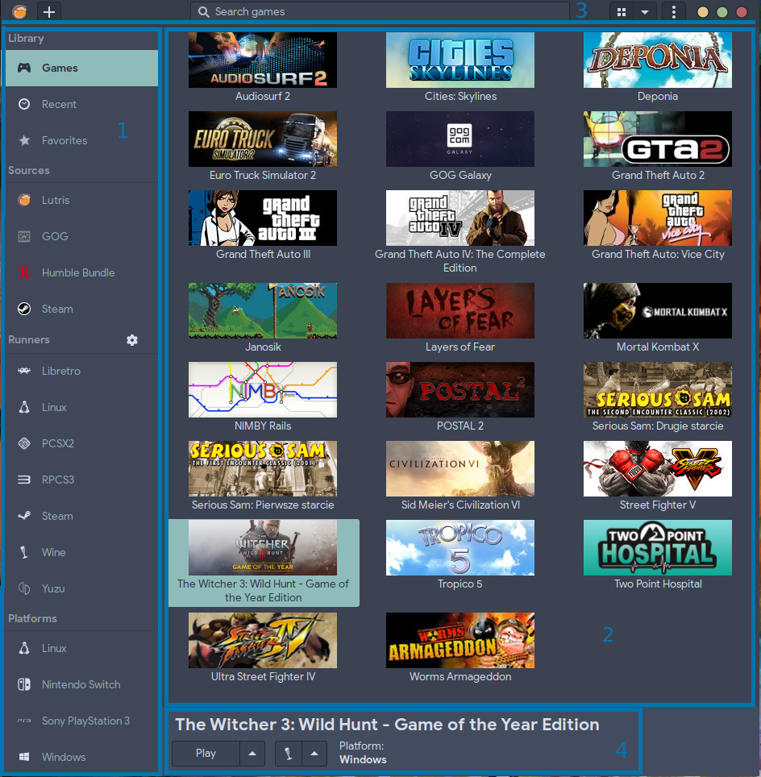

### 2. Źródła gier
W Lutrisie dostępne są cztery źródła z których można łatwo instalować gry. Są to:
- skrypty Lutris (nie wymaga zalogowania)
- GOG (wymaga zalogowania)
- Humble Bundle (wymaga zalogowania)
- Steam (wymaga zalogowania)

W celu użycia platformy GOG, Humble Bundle lub Steam należy się zalogować. Aby to uczynić klikamy na przycisk widniejący tuż obok nazwy źródła.

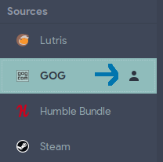

Następne logujemy się na wybranej platformie i ewentualnie zezwalamy na dostęp Lutris do biblioteki gier.


W przypadku poprawnego zalogowania powinny ukazać się tytuły przypisane do konta.


### 3. Metody instalacji gier
W celu instalacji gier możesz wykorzystać jedną z poniższych metod:
- instalacja przez skrypty użytkowników
- instalacja z biblioteki gier (Steam, GOG, Humble Bundle [wkrótce Epic Store Games])
- instalacja manualna
- instalacja z własnego skryptu (zaawansowana)

### 4. Instalacja ze skryptu użytkowników
1. Po uruchomieniu Lutris wybieramy sekcję "Lutris" w Sources". Następnie będąc w zakładce "Community Installers" wpisujemy do wyszukiwarki nazwę poszukiwanej gry. Po wyszukaniu pozycji klikamy lewym przyciskiem myszy na nią i rozpoczynamy instalację "Install".

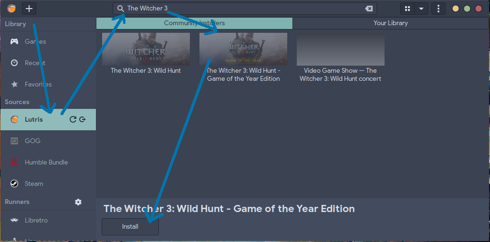

***
UWAGA! 

Przebieg instalacji może się różnić w zależności od skryptu i jego złożoności. Przedstawony niżej przykład jest reprezentatywny - gra dla systemu Windows pobierana z serwisu GOG - https://gog.com/.
***
2. Pojawi się lista z możliwymi instalacjami do wyboru - w tym przypadku jest dostępna instalacja przez GOG. Klikamy na przycisk "Install", aby kontynuować.

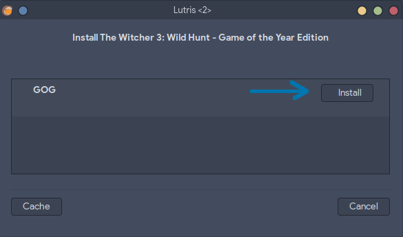

3. W kolejnym oknie wskazujemy ścieżkę, gdzie gra ma zostać zainstalowana - możemy w tym celu wykorzystać przycisk "Browse" i wskazać ścieżkę lub wpisać ją ręcznie. Po dokonaniu wyboru klikamy na przycisk "Install".

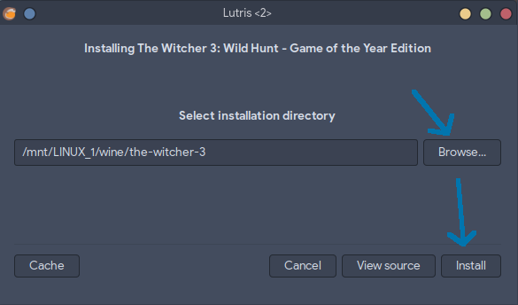

4. Skrypt instalacyjny może wymagać pobrania dodatkowego runnera (w tym przypadku Wine 6.10) lub innych plików wymaganych do zainstalowania lub uruchomienia gry. Należy poczekać na zakończenie pobierania i instalacji.

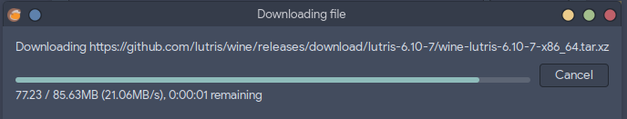

5. Skrypt może wymagać wskazania nośnika instalacji (na przykład płyty CD/DVD), plików instalacyjnych gry (na przykład wcześniej pobranych z GOG) lub pobrania plików z Internetu. W tym celu możemy wybrać akcję za pomocą przycisków przy "Source:". Po dokonaniu wyboru - klikamy na przycisk "Continue".

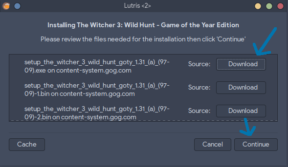

6. W tym przykładzie pokazany jest proces pobierania gry z platformy GOG. Należy chwilę poczekać na ukończenie pobierania. Po chwili zostanie uruchomiony instalator gry znany z systemu Windows.

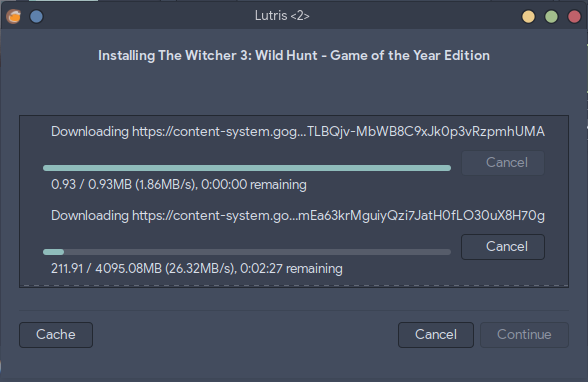

7. Instalator gry uruchomił się. Ważne jest to, aby pozostawić domyślną ścieżkę instalacji.

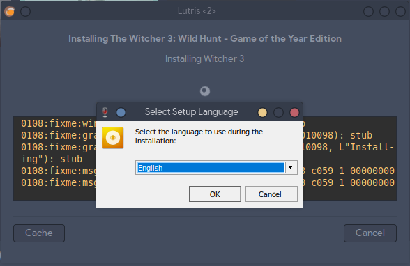


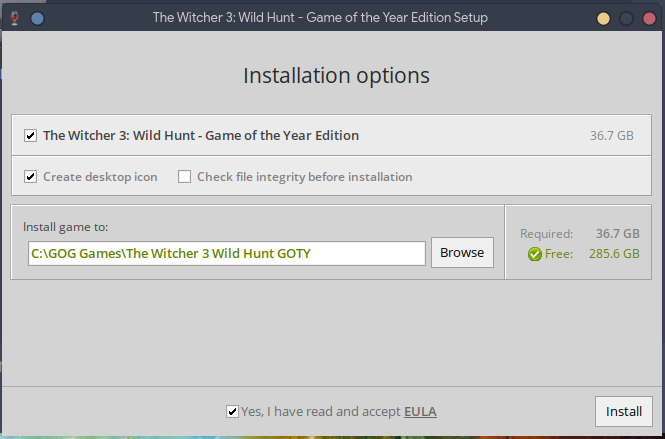

8. Gra instaluje się, należy poczekać na zakończenie działania instalatora.

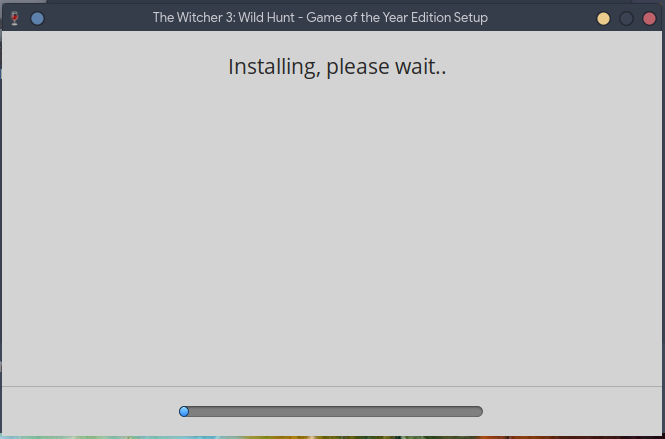

9. Gra została zainstalowana. Jeśli instalator oferuje funkcję jej włączenia - zignoruj to i wyjdź z instalatora.


10. Lutris poinformuje o zakończeniu procesu instalacji. W tym momencie można utworzyć skróty jeśli są potrzebne, uruchomić grę lub zakończyć działanie.

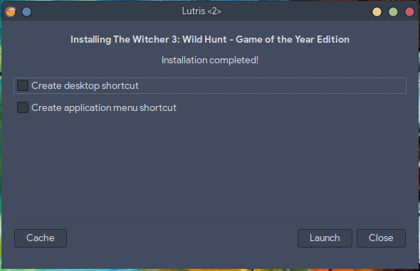

### 5. Instalacja z biblioteki gier
1. Po uruchomieniu Lutris wybieramy odpowiednią bibliotekę gier. Następnie z listy wskazujemy interesującą pozycję i klikamy przycisk "Install".

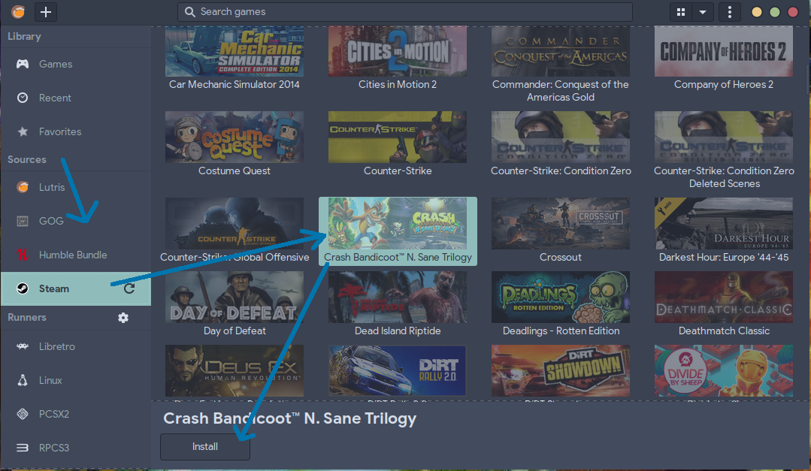

2. Wyświetli się instalator w którym potwierdzamy sposób instalacji gry.

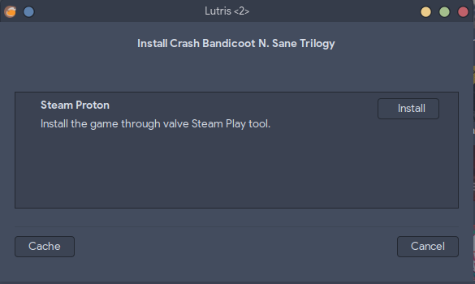

3. W przypadku platformy Steam instalator zakończy działanie umożliwiając dodanie skrótów. Nie jest to koniec instalacji. Klikamy na przycisk "Launch", aby uruchomić klienta Steam i dokończyć instalację.

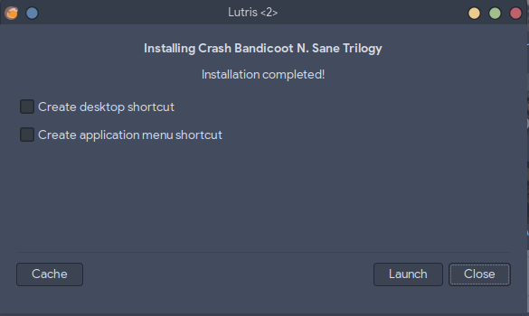

W przypadku platform GOG oraz Humble Bundle uruchomi się generowany skrypt, a instalacja będzie podobna do tej z podpunktu 4.

### 6. Instalacja manualna
Szczegóły wkrótce.

### 7. Instalacja z własnego skryptu
Instalacja z własnego skryptu wymaga wiedzy z ich tworzenia. Więcej szczegółów można znaleźć na stronie głównej oprogramowania - https://lutris.net/