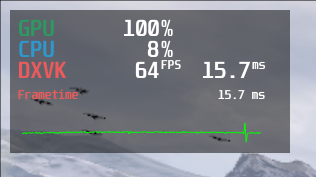

# 3.7 MangoHud
MangoHud jest nakładką - benchmarkiem - dla oprogramowania wykorzystującego technologię OpenGL oraz Vulkan (w tym DXVK). Umożliwia ona wyświetlanie na ekranie informacji o temperaturze podzespołów, ich wykorzystaniu, ilości klatek wyświetlanego obrazu, etc..

Wyglądem przypomina znany z Windowsa MSI Afterburner z nakładką RivaTuner.



## Instalacja
```
sudo dnf install mangohud
```

## Jak to działa?
Uruchomienie MangoHud opiera się na poprzedzeniu uruchamianej komendy wpisem mangohud.

Przykłady:
```
mangohud ~/file.sh
```
```
mangohud wine ~/gra/gra.exe
```

W przypadku gier OpenGL należy dodać dodatkowo parametr MANGOHUD_DLSYM=1, czyli na przykład:
```
MANGOHUD_DLSYM=1 mangohud ~/file.sh
```

## Konfiguracja MangoHud
Pliki konfiguracyjne MangoHud mogą być umiejscowione w trzech miejsach:
1. dołączony do katalogu z grą, na przykład:
```
~/gra/MangoHud.conf
```
2. w katalogu konfiguracyjnym zalogowanego użytkownika jako główny plik konfiguracyjny MangoHud.conf:
```
$HOME/.config/MangoHud/MangoHud.conf
```
3. w katalogu konfiguracyjnym zalogowanego użytkownika jako plik dedykowany dla pojedynczej aplikacji:
```
$HOME/.config/MangoHud/{nazwa_aplikacji}.conf
```

Szczegółowy opis plików konfiguracyjnych znajdziesz tutaj:

[https://github.com/flightlessmango/MangoHud#mangohud_config-and-mangohud_configfile-environment-variables](https://github.com/flightlessmango/MangoHud#mangohud_config-and-mangohud_configfile-environment-variables)

Pełna dokumentacja dotycząca MangoHud znajduje się tutaj:
[https://github.com/flightlessmango/MangoHud](https://github.com/flightlessmango/MangoHud)