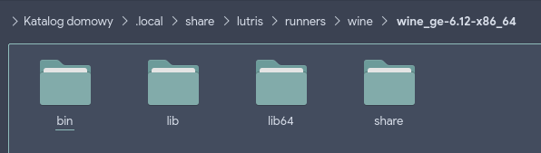

# 3.10 Zmodyfikowane wersje Wine i Proton
Oprócz standowych wydań Wine i Proton istnieją również zmodyfikowane przez społeczność wersje.
Często zawierają one poprawki i ulepszenia umożliwiające uruchamianie gier lub przyspieszenie ich działania.

## Polecane modyfikacje
Wśród społeczności, która opiekuje się modyfikacjami Wine i Proton wyróżniają się cztery poniższe źródła:

GloriousEggroll - Wine: https://github.com/GloriousEggroll/wine-ge-custom/releases

GloriousEggroll - Proton: https://github.com/GloriousEggroll/proton-ge-custom/releases

Frogging Family - Wine oraz Proton: https://github.com/Kron4ek/Wine-Builds/releases

Kron4ek - Wine: https://github.com/Kron4ek/Wine-Builds/releases

## Instalacja zmodyfikowanego Wine i Proton
Poniższe podrozdziały opisują instalację Wine oraz Proton w aplikacjach Lutris oraz Steam.

### Instalacja zmodyfikowanego Wine w Lutris
***
WAŻNE

Poniższy przykład jest reprezentatywny - oparty na GloriousEggroll Wine.
W przypadku innych wydań schemat działania jest podobny.
***
1. Pobieramy plik ze zmodyfikowanym Wine na dysk.


2. Rozpakowujemy plik za pomocą dowolnego menedżera archiwów.
3. Przechodzimy do katalogu, gdzie rozpakowany został plik i w nim poszukujemy struktury katalogów podobnej jak na zdjęciu poniżej.


4. Znalezione katalogi należy skopiować do katalogu z runnerami Lutrisa. W tym celu otwieramy drugie okno/drugą zakładkę menedżera plików i przechodzimy do:
```
~/.local/share/lutris/runners/wine/
```
5. W nim tworzymy katalog dedykowany dla zmodyfikowanego Wine.


6. Kopiujemy znalezioną strukturę katalogów do utworzonego katalogu.



7. Restartujemy Lutris.


### Instalacja zmodyfikowanego Protona w Steam
1. Pobieramy plik ze zmodyfikowanym Protonem na dysk.


2. Rozpakowujemy plik za pomocą dowolnego menedżera archiwów.
3. Rozpakowany katalog należy skopiować do katalogu:
```
~/.steam/steam/compatibilitytools.d/
```
Jeśli katalog compatibilitytools.d nie jest dostępny należy go utworzyć.


Wnętrze skopiowanego katalogu powinno zawierać strukturę podobną do zrzutu poniżej.


4. Restartujemy Steam.

### Instalacja zmodyfikowanego Protona w Lutris (niezalecane)
***
UWAGA #1

Proton jest przeznaczony dla biblioteki gier Steam i z nią jest kompatybilna. Instalacja Protona w Lutris jest możliwa lecz niezalecana z powodu możliwego konfliktu struktur plików i katalogów.
***

***
UWAGA #2

Nie należy zmieniać w ustawieniach gry Wine na Proton i odwrotnie - spowoduje to masę problemów z zależnościami.
***

***
WAŻNE

Poniższy przykład jest reprezentatywny - oparty na GloriousEggroll Proton.
W przypadku innych wydań schemat działania jest podobny.
***
1. Pobieramy plik ze zmodyfikowanym Protonem na dysk.


2. Rozpakowujemy plik za pomocą dowolnego menedżera archiwów.
3. Przechodzimy do katalogu, gdzie rozpakowany został plik i w nim poszukujemy struktury katalogów podobnej jak na zdjęciu poniżej.


4. Znalezione katalogi należy skopiować do katalogu z runnerami Lutrisa. W tym celu otwieramy drugie okno/drugą zakładkę menedżera plików i przechodzimy do:
```
~/.local/share/lutris/runners/wine/
```
5. W nim tworzymy katalog dedykowany dla zmodyfikowanego Protona.


6. Kopiujemy znalezioną strukturę katalogów do utworzonego katalogu.


7. Restartujemy Lutris.

## Uruchamianie gier przy pomocy zmodyfikowanego Wine i Proton
Poniższe podrozdziały pomogą skonfigurować Lutris oraz Steam do uruchomienia gier ze zmodyfikowanymi wersjami Wine oraz Proton.

### Lutris
1. Klikamy prawym przyciskiem na grę, którą chcemy skonfigurować i klikamy na opcję "Configure".


2. Przechodzmy do zakładki "Runner options" i w niej zmieniamy wartość "Wine version" na właściwą dla zmodyfikowanej wersji (jest to nic innego jak nazwa utworzonego katalogu).


3. Zapisujemy zmiany i uruchamiamy grę.

### Steam
1. Uruchamiamy Steam i przechodzimy do ustawień (Steam -> Ustawienia).
2. W ustawieniach klikamy "Steam Play" z menu po lewej stronie, a następnie wybieramy z listy odpowiednią wersję.


3. Zapisujemy zmiany - należy uruchomić ponownie Steam.