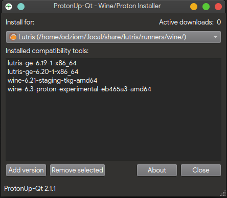
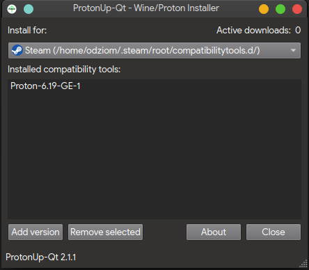
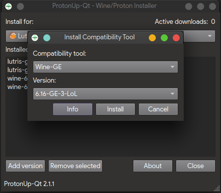

# ProtonUp-Qt
## Czym jest ProtonUp-Qt?
Jest to prosta w obsłudze aplikacja pozwalająca pobrać dowolną wersję Wine lub Proton i umieścić ją w Steam lub Lutris.

## Obsługiwane Wine oraz Proton
Poniżej znajdziesz listę narzędzi obsługiwanych przez aplikację.
Dla Steam dostępne są:
- Proton-GE (GloriousEggroll)
- Luxtorpeda (lista gier obsługujących ten launcher znajduje się tutaj: https://github.com/dreamer/luxtorpeda/#supported-titles)

Dla Lutris dostępne są:
- Wine-GE (GloriousEggroll)
- Kron4ek Wine-Builds Vanilla
- Lutris-Wine

## Jak zainstalować ProtonUp-Qt?
Najnowsza wersja ProtonUp-Qt dostępna jest tutaj: 

https://davidotek.github.io/protonup-qt/

Po pobraniu pliku AppImage możesz przenieść plik w dowolne miejsce.
Aby go uruchomić musisz nadać uprawnienia wykonywania pliku, w terminalu zrobisz to wykonując:
```
chmod +x ProtonUp-Qt*.AppImage
```
Po wykonaniu tego kroku możesz uruchomić aplikację - z terminala lub dwukrotnie klikając na pliku w trybie graficznym.

Istnieje możliwość zintegrowania aplikacji przez AppImageLauncher - więcej o AppImageLauncher przeczytasz tutaj: https://docs.appimage.org/user-guide/run-appimages.html#integrating-appimages-into-the-desktop

## Obsługa ProtonUp-Qt
Po uruchomieniu ProtonUp-Qt w oknie głównym programu możesz przejrzeć listę zainstalowanych wersji Wine/Proton. Przykłady dla Steam i Lutrisa znajdziesz na screenach poniżej.





Z poziomu aplikacji możemy usuwać istniejące wersje jak i dodawać nowe.
Aby dodać nową należy kliknąć na przycisk Add version, a następnie wybrać jedną z dostępnych gałęzi i wersję potwierdzając przyciskiem Install.



Po zainstalowaniu możesz uruchomić aplikację Steam lub Lutris, aby skorzystać z nowych wersji.

Aby usunąć wersję zaznacz ją i kliknij na przycisk Remove selected.