# Epic Games Store na Linuksie przy pomocy oprogramowania Lutris
Instalacja Epic Games Store na Linuksie ze względu na ogromną liczbę zależności jest dość zaawansowana. Z pomocą przychodzi Lutris i wsparcie dla EGS z jego poziomu.

## Konfiguracja Epic Games Store
1. Uruchom program Lutris i przejdź do ustawień programu (`Preferences`).
2. W nowym oknie przejdź do zakładki `Services`, a następnie zaznacz opcję przy "Epic Store Games".

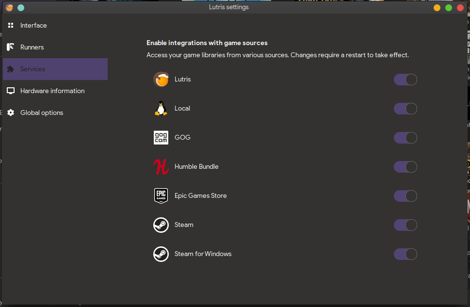
3. Wróć do głównego okna programu i zaloguj się do Epic Games Store wybierając przycisk logowania panelu z lewej strony przy wpisie `Epic Games Store`.
   

## Instalacja Epic Games Store
Do właściwej instalacji launchera zachodzi przy próbie instalacji gry. Wykorzystany został tutaj przykład na podstawie gry Control.

1. Uruchamiamy Lutris i przechodzimy do zakładki `Epic Games Store`. Z listy wybierz grę (dla przykładu Control), a następnie kliknij na przycisk `Install`, aby rozpocząć.

***
Ważne!
Przy próbie instalacji czegokolwiek z Epica może wystąpić błąd:
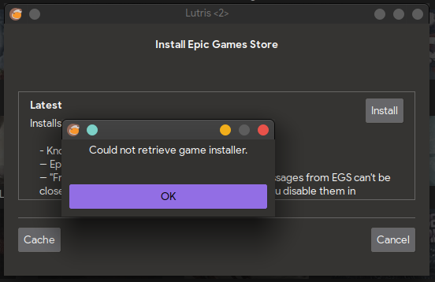

Nie przejmuj się, po prostu kliknij `OK` - prawdopodobnie EGS w Lutris nie jest jeszcze dopracowane.
***

2. Kliknij na przycisk `Install` przy wpisie `Latest`, aby rozpocząć.

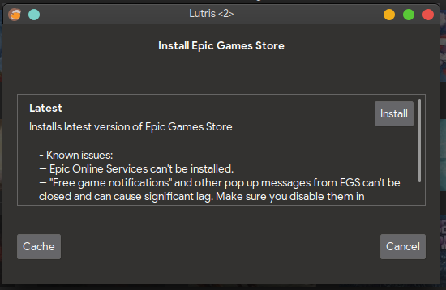

3. Wskaż miejsce, gdzie chcesz zainstalować Epic Games Store.

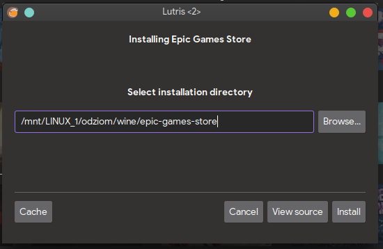

4. W kolejnym oknie pozostaw domyślne opcje i kontynuuj.

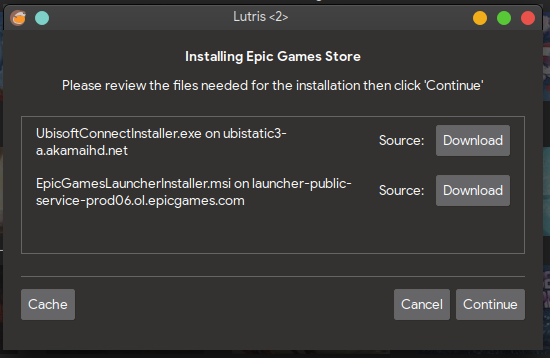

5. Poczekaj na zakończenie instalacji, skrypt w Lutris zainstaluje Epic Games Store wraz z potrzebnymi zależnościami.

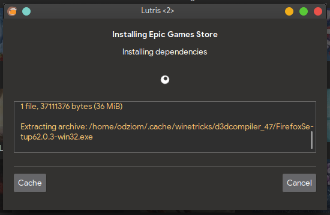

6. Po zainstalowaniu kliknij przycisk `Close`. Epic Games Store został zainstalowany. Tę operację wykonujesz tylko raz.

## Instalacja gier
Kontynuujemy zabawę instalując właściwą grę - ponownie w tym przykładzie użyta zostanie gra Control.

1. W głównym oknie programu wybierasz interesującą grę i klikasz na przycisk `Install`.

2. W nowym oknie potwierdź chęć instalacji klikając na przycisk `Install`.

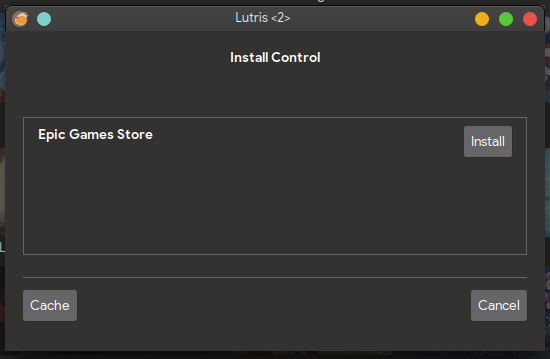

3. Jako że Epic Games Store został zainstalowany uruchomi się przy próbie instalacji gry.

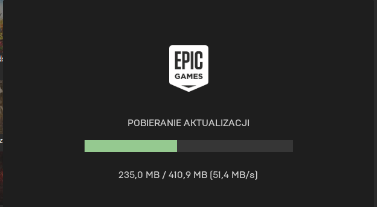

4. Jeśli to pierwsze uruchomienie - zaloguj się do Epic Games Store.

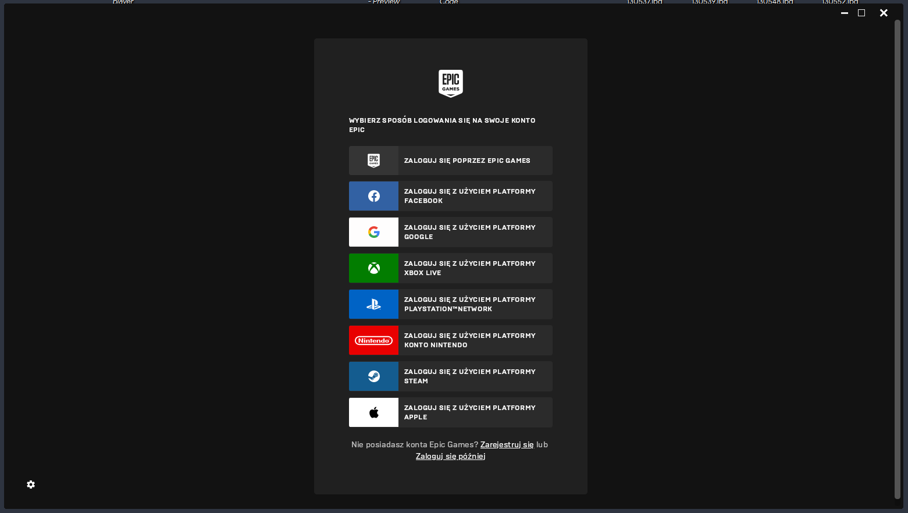

5. Po zalogowaniu nastąpi kontynuacja instalacji gry. Pozostaw wszystkie opcje domyślne i kontynuuj instalację.

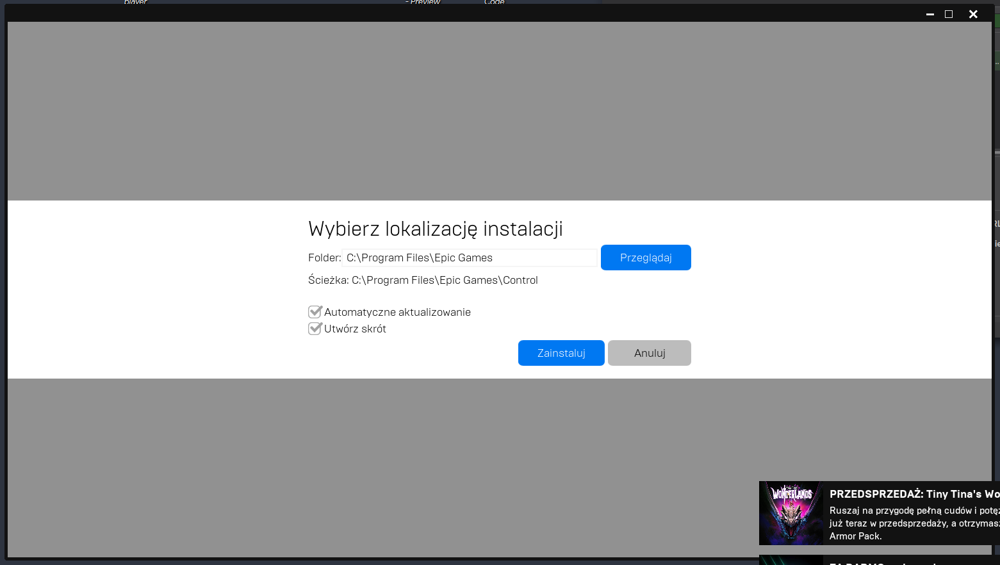

6. Gra instaluje się. Po zakończeniu instalacji na Epic Games Store zamknij klienta Epic Games Store, aby Lutris dodał odpowiedni skrót.

7. Po instalacji gra powinna pojawić się w bibliotece.

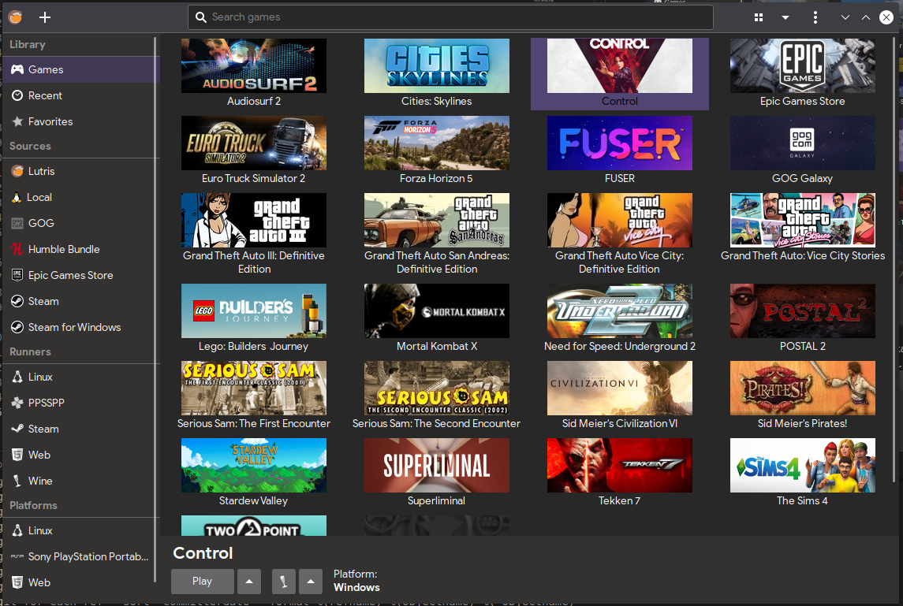

## Uruchamianie gier
Uruchomienie gry z Epic Games Store jest bajecznie proste.
Kliknij na tytuł z biblioteki dwukrotnie lub kliknij raz i skorzystaj z przycisku `Play` na dolnym panelu. Uruchomi się Epic Games Store a wraz z nią gra.

Poniżej umieszczony został przykład konfiguracji gry w Lutris:
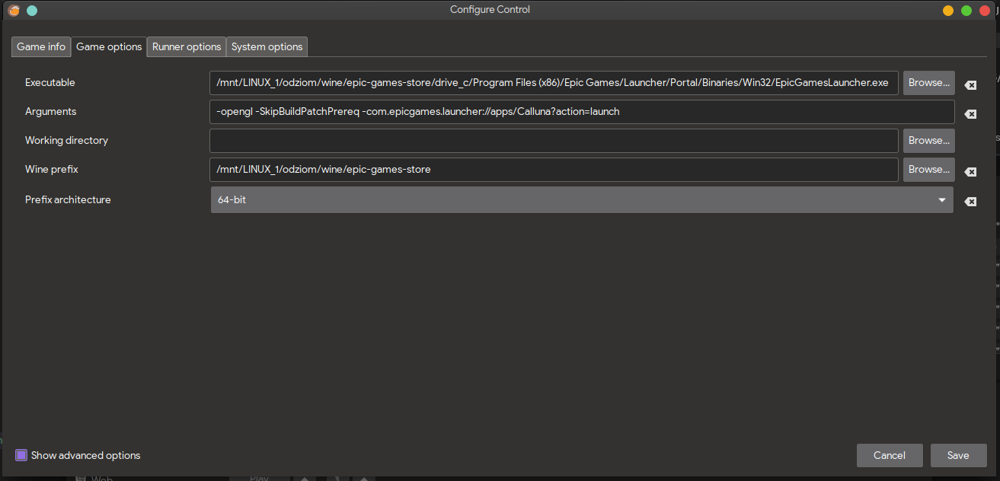