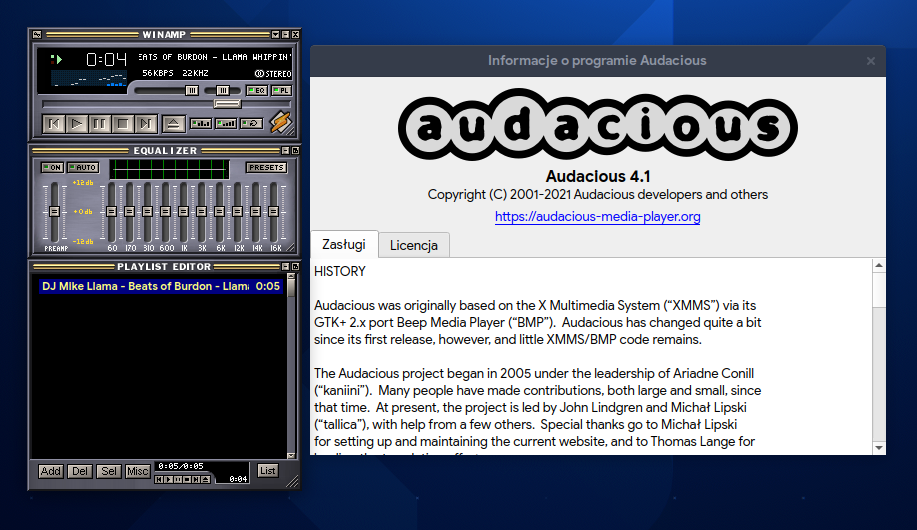
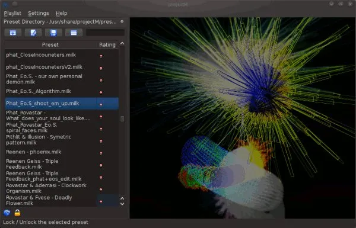

# 4.1 Oprogramowanie audio

## Audacious
Otwarzacz muzyczny z obsługą skinów z Winampa.



Instalacja przez dnf:
```
sudo dnf install audacious
```
Instalacja przez Flatpak:
```
flatpak install flathub org.atheme.audacious
```

## Spotify
Popularny klient muzycznego serwisu streamingowego Spotify.

Instalacja przez dnf:
```
sudo dnf install lpf-spotify-client
lpf update
```
Instalacja przez Flatpak:
```
flatpak install flathub com.spotify.Client
```

## ProjectM
Oprogramowanie do wizualizacji odtwarzanego dźwięku.



Instalacja przez dnf:
```
sudo dnf install projectM-pulseaudio
```
Instalacja przez Flatpak:
```
flatpak install flathub net.sourceforge.projectM
```