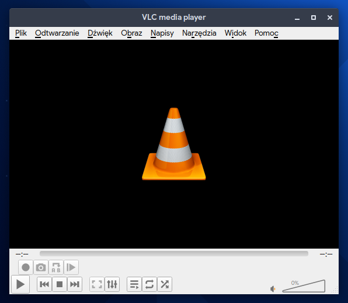

# 4.2 Oprogramowanie wideo

## VLC
Odtwarzacz multimedialny z ogromną biblioteką kodeków.



Instalacja przez dnf:
```
sudo dnf install vlc
```

Instalacja przez Flatpak:
```
flatpak install flathub org.videolan.VLC
```

## Kdenlive
Edytor wideo dla użytku domowego lub półprofesjonalnego.

Instalacja przez dnf:
```
sudo dnf install kdenlive
```
Instalacja przez Flatpak:
```
flatpak install flathub org.kde.kdenlive
```