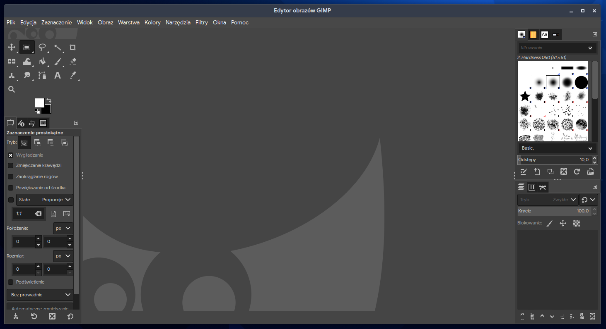
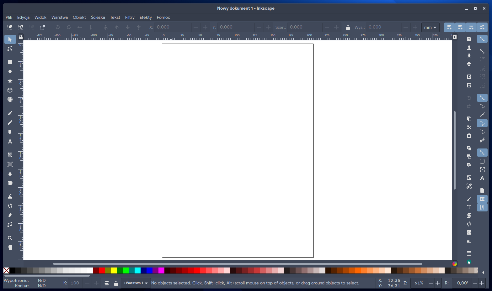

# 4.3 Oprogramowanie graficzne

## GIMP
Otwartoźródłowy program do edycji grafiki rastrowej.



Instalacja przez dnf:
```
sudo dnf install gimp
```
Instalacja przez Flatpak:
```
flatpak install flathub org.gimp.GIMP
```
## Inkscape
Otwartoźródłowy program do edycji grafiki wektorowej.



Instalacja przez dnf:
```
sudo dnf install inkscape
```
Instalacja przez Flatpak:
```
flatpak install flathub org.inkscape.Inkscape
```
## Krita
Oprogramowanie do tworzenia grafiki rastrowej od podstaw. Skierowana głównie do malowania.

Instalacja przez dnf:
```
sudo dnf install krita
```
Instalacja przez Flatpak:
```
flatpak install flathub org.kde.krita
```