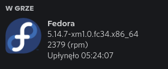

# Fetchcord

## Czym jest Fetchcord?
Fetchcord jest dodatkowym oprogramowaniem dla systemu Linux pozwalającym wyswietlać informacje o systemie w aplikacji Discord jako status.



## Jak zainstalować Fetchcord?
Przed instalacją należy upewnić się, czy są zainstalowane Python i PIP.

Następnie, aby zainstalować Fetchcord wykonujemy komendę:
```
pip3 install fetchcord
```
Po zainstalowaniu można uruchomić aplikację w domyślnej konfiguracji wpisując komendę:
```
fetchcord
```
Jeśli komenda ```fetchcord``` nie zadziała to najprawdopodobniej należy dopisać ścieżkę uruchomieniową do zmiennej systemowej ```PATH```. W tym celu należy uruchomić plik ```.bashrc``` lub ```.zshrc``` lub inny w zależności od posiadanej powłoki i dopisać w nim linijkę:
```
export PATH="$HOME/.local/bin:$PATH"
```
Po dodaniu wpisu zapisujemy plik i restartujemy terminal. Komenda ```fetchord``` powinna wykonać się bez problemów.

## Uruchamianie Fetchcord jako usługa systemowa
Istnieje możliwość, aby uruchomić Fetchcord jako usługę systemową. W tym celu należy wykonać kilka komend. Na początek należy pozwolić na zainstalowanie pliku usługi dla konkretnego użytkownika posługując się komendą:
```
fetchcord --install
```
Komenda ta spowoduje utworzenie linku symbolicznego (w systemie Windows można porówać to ze skrótem do pliku).

Następnie usługę należy uruchomić przy pomocy komendy:
```
systemctl --user enable --now fetchcord
```
Jeśli wszystko jest w porządku to w statusie Discorda powinny się pojawiać domyślnie naprzemiennie informacje o systemie i sprzęcie. W przypadku problemów należy wyedytować plik usługi:
```
~/.local/share/systemd/user/fetchcord.service
```
W nim edytujemy linię ```ExecStart``` w sekcji ```[Service]``` na ścieżkę bezwzględną do aplikacji fetchcord. Przykładowy wpis będzie wyglądał jak w opisanej sekcji poniżej:
```
[Service]
Environment=PYTHONUNBUFFERED=1
ExecStart=/home/<nazwa_uzytkownika>/.local/bin/fetchcord --nohardware --noshell --nohost --noconfig --time 60 -p
Restart=always
RestartSec=10
```
Po podmianie wpisu ponawiamy próbę uruchomienia usługi Fetchcord opisaną wcześniej.

## Zmienne programu Fetchcord
Działanie programu Fetchcord można modyfikować do własnych potrzeb. W tym celu należy wykorzystać zmienne, które dopisujemy do komendy uruchomieniowej programu lub w linii ```ExecStart``` usługi.

Lista możliwych opcji znajduje się poniżej:
```
--nodistro - pominiecie informacji o dystrybucji

--nohardware - pominiecie informacji o sprzęcie

--noshell - pominiecie informacji o terminalu i używanej powłoce systemowej

--nohost - pominiecie informacji o hoście

--time, -t, - ustawia czas rotacji opisów

--pause-cycle - dodaje dodatkową pauzę, przerywa działanie Fetchcorda (opcja przydatna, gdy chcemy wyświelać również inne statusy z aplikacji lub gier komputerowych)

```
Dodatkowo można użyć opcji:
```
--update - aktualizuję bazę sprzętu

--debug - debuguje Fetchcord

--memtype - określa jednostkę dla pamięci RAM (MB lub GB)

```

## Plik konfiguracyjny programu Fetchcord
Fetchcord można skonfigurować, aby wyświetlał znacznie więcej informacji niż domyślnie - na przykład temperatury podzespołów lub dłuższe nazwy sprzętu i znacznie więcej. W tym celu należy wyedytować plik:
```
~/.config/neofetch/config.conf
```
Opcji konfiguracji jest bardzo dużo, wszystkie są opisane w komentarzach tego pliku.