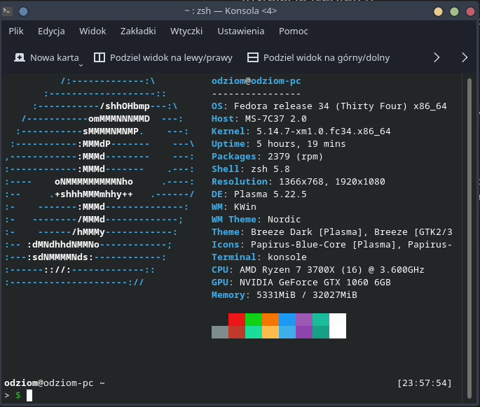

# Neofetch

## Czym jest Neofetch
Neofetch jest oprogramowaniem, które wyświetla informacje o systemie i sprzęcie w interpretacji graficznej i tekstowej.



## Instalacja Neofetch
Instalacja oprogramowania Neofetch ogranicza się do wpisania jednej komendy:
```
sudo dnf install neofetch
```

## Uruchomienie Neofetch
Neofetch można uruchomić jednorazowo wpisując w terminalu komendę:
```
neofetch
```
Jeśli jest zapotrzebowanie na uruchomienie jej każdorazowo przy włączeniu terminala należy dopisać do pliku ```.bashrc``` lub ```.zshrc``` lub innego podobnego linię:
```
neofetch
```
i zapisać plik po dokonaniu zmian.
